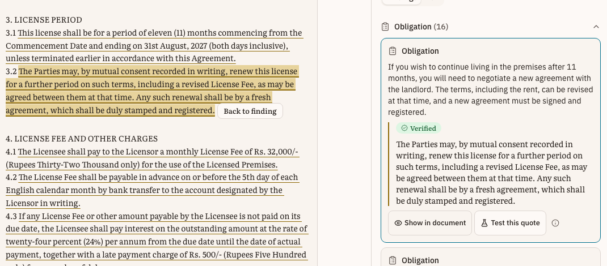
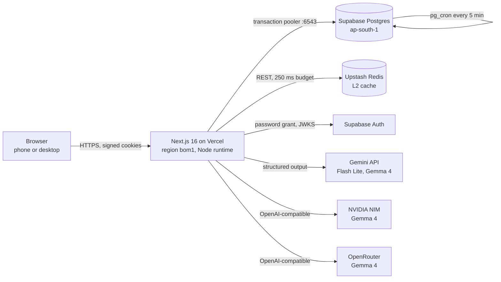
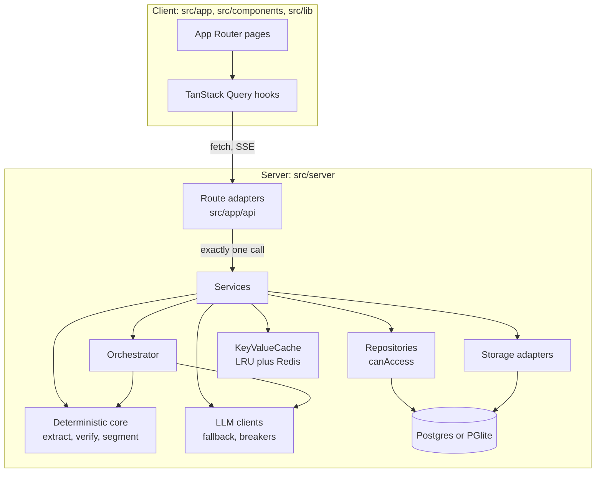
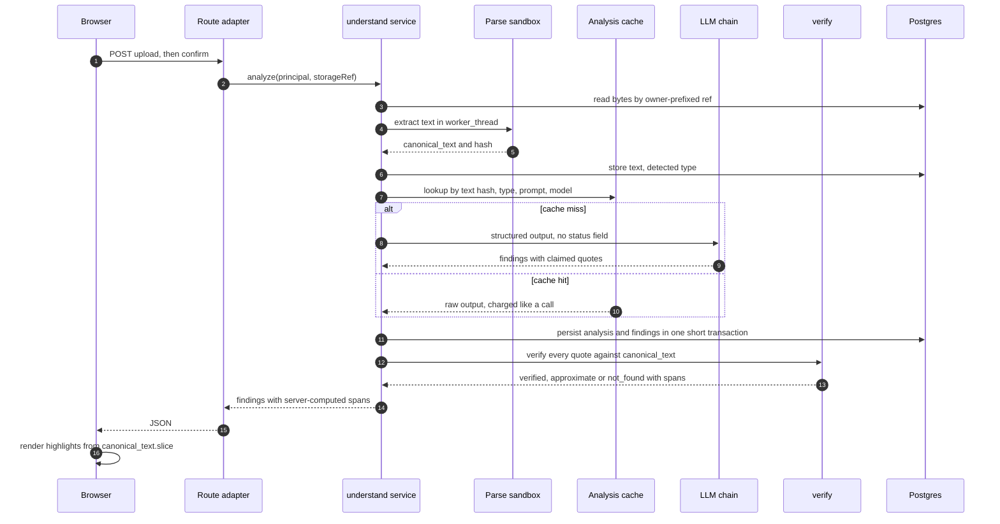
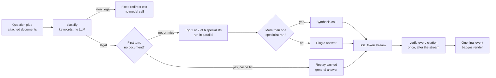
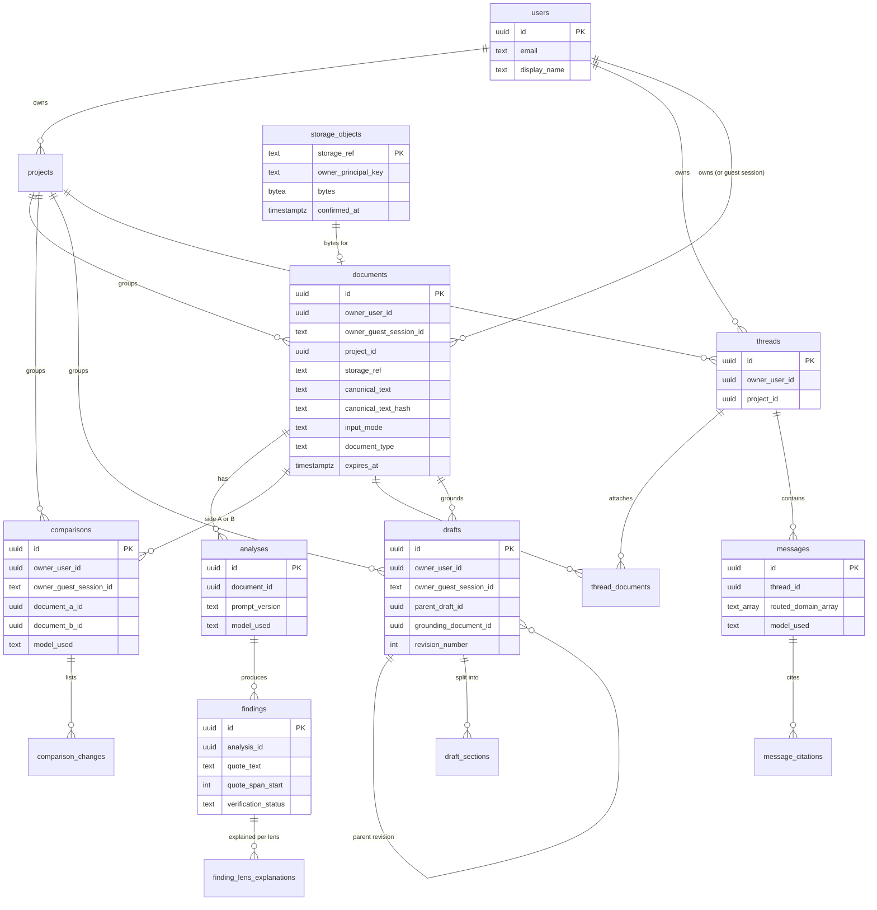
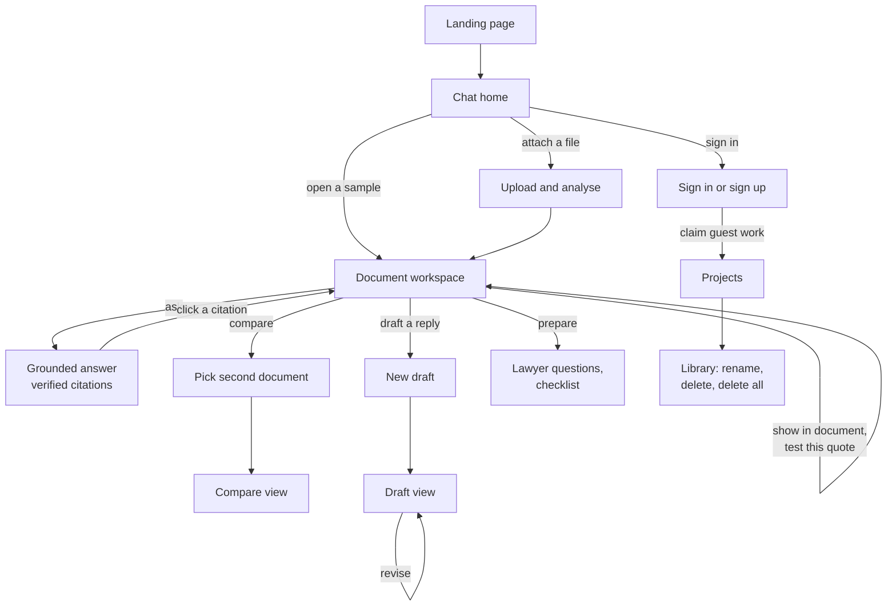
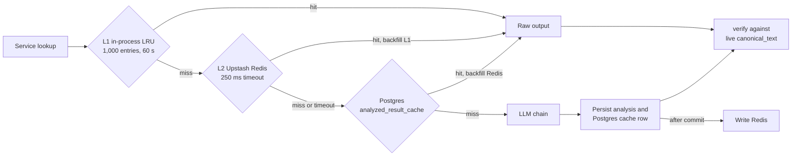

# Saboot (सबूत — "proof, evidence")

**Plain-language answers about your legal documents, with proof of where each one comes from.**

[](.github/workflows/ci.yml)


Saboot is a GenAI legal-information assistant for Indian tenants, employees and freelancers. It
reads a lease, an offer letter, an NDA, a privacy policy or a freelance agreement, says in plain
language what it commits you to, and shows exactly where in your own document it says so. It
compares two versions, answers questions with checked citations, prepares questions for a lawyer
and drafts documents.

**Live demo: <https://saboot.vercel.app>**

- **The One Guarantee.** A quote is shown as `verified` only after deterministic server code has
  found that exact text in your document, on that request. The model never decides.
- **Built for Indian documents.** Leave-and-license agreements, offer letters, NDAs, privacy
  policies and freelance contracts, with Indian jurisdiction stored on every document and draft.
- **Information, never advice.** No risk scores, no severity ratings, a fixed disclaimer under
  every composer, and a non-LLM classifier that refuses off-topic questions.

<picture>
  <source media="(prefers-color-scheme: dark)" srcset="public/assets/landing/hero-dark.png">
  
</picture>

> [!IMPORTANT]
> **Saboot explains documents. It isn't legal advice.** It helps you read, compare and prepare for a
> conversation with a lawyer. Every AI-written answer is labelled as AI-generated.

The package name `lawyer-up-v3` is an earlier working name. Every user-facing surface says **Saboot**.

## Contents

1. [Problem-statement alignment](#problem-statement-alignment)
2. [Features](#features)
3. [Architecture](#architecture)
4. [The One Guarantee](#the-one-guarantee)
5. [GenAI architecture](#genai-architecture)
6. [Data model](#data-model)
7. [User flows](#user-flows)
8. [Engineering quality](#engineering-quality): [code quality](#code-quality) ·
   [security](#security-and-privacy) · [efficiency](#efficiency) · [testing](#testing) ·
   [accessibility](#accessibility)
9. [Run it locally](#run-it-locally) · [Deploy](#deploy) · [Configuration](#configuration)
10. [Project structure](#project-structure)
11. [Known limits](#known-limits)
12. [Documentation](#documentation)

<a id="problem-statement-alignment"></a>

## Problem-statement alignment

> "Legal information can often be complex, difficult to understand, and challenging to navigate
> without professional assistance. Build a GenAI-powered solution that makes legal information and
> basic legal assistance more accessible by helping users understand, compare, and navigate legal
> documents and information."

| # | Use case (verbatim) | Saboot feature | Route · service · screen |
|---|---|---|---|
| 1 | "Simplifying complex legal documents" | **Analyse**: plain-language findings, each with a verified quote, explained for the reader's role and stage | [`analyze/route.ts`](src/app/api/documents/[id]/analyze/route.ts) · [`understand.ts`](src/server/services/understand.ts) · [`workspace-client.tsx`](src/components/workspace/workspace-client.tsx) |
| 2 | "Comparing contracts, agreements, or policies" | **Compare**: deterministic clause alignment, then one model call to explain each change, verified per side | [`comparisons/route.ts`](src/app/api/comparisons/route.ts) · [`compare.ts`](src/server/services/compare.ts), [`segment.ts`](src/server/deterministic/segment.ts) · [`compare-view.tsx`](src/components/compare/compare-view.tsx) |
| 3 | "Highlighting important clauses, obligations, risks, or inconsistencies" | Findings tagged `obligation`, `deadline`, `penalty`, `ambiguity`, `missing_clause`, highlighted in the document; a deterministic checklist flags protections that may be missing | [`document-type-registry.ts`](src/server/deterministic/document-type-registry.ts), [`find-missing.ts`](src/server/deterministic/standard-clauses/find-missing.ts) · [`findings-pane.tsx`](src/components/workspace/findings/findings-pane.tsx), [`highlight-mark.tsx`](src/components/document/highlight-mark.tsx) |
| 4 | "Answering questions based on provided legal documents" | **Ask**: streamed chat grounded in attached documents; each citation is verified before its badge appears | [`ask/route.ts`](src/app/api/ask/route.ts) · [`ask.ts`](src/server/services/ask.ts), [`run-orchestrator.ts`](src/server/orchestrator/run-orchestrator.ts) · [`ask-panel.tsx`](src/components/workspace/ask/ask-panel.tsx) |
| 5 | "Helping users understand their options and potential next steps" | **Lenses** reframe findings for where you stand (for example, a tenant before or after signing); **general chat** answers without a document, labelled as unverified general information | [`lenses.ts`](src/server/prompts/understand/lenses.ts), [`ask.ts`](src/server/services/ask.ts) · [`lens-toggle.tsx`](src/components/workspace/lens/lens-toggle.tsx), [`situation-chips.tsx`](src/components/chat/situation-chips.tsx) |
| 6 | "Generating summaries, checklists, or other actionable outputs" | **Prepare**: a before-you-sign checklist and a Markdown export; **Draft**: five document types with revisions and export | [`prepare.ts`](src/server/services/prepare.ts), [`markdown.ts`](src/server/deterministic/prepare-export/markdown.ts), [`draft.ts`](src/server/services/draft.ts) · [`prepare-view.tsx`](src/components/prepare/prepare-view.tsx) |
| 7 | "Helping users prepare information or questions for a legal professional" | **Prepare for a lawyer**: questions built only from verified findings, each linked to its quote | [`prepare/route.ts`](src/app/api/documents/[id]/prepare/route.ts) · [`prepare.ts`](src/server/services/prepare.ts) · [`lawyer-question-card.tsx`](src/components/prepare/lawyer-question-card.tsx) |
| — | Guideline: *"Solutions should provide information and assistance, rather than replace professional legal advice."* | One fixed disclaimer under every composer and in the footer; every specialist prompt says "information, not advice"; a non-LLM classifier refuses non-legal questions with fixed text; no risk rating anywhere | [`legal-advice.ts`](src/shared/copy/legal-advice.ts), [`disclaimer-line.tsx`](src/components/brand/disclaimer-line.tsx), [`shared.ts`](src/server/prompts/orchestrator/shared.ts), [`classify.ts`](src/server/orchestrator/classify.ts), [`redirect.ts`](src/server/prompts/orchestrator/redirect.ts) |

**Tuned document types:** leave-and-license, job offer letter, NDA, privacy policy and freelance
service agreement. Anything else is still analysed, and labelled `generic`. Scope, principles and
exclusions are in [docs/PRODUCT.md](docs/PRODUCT.md).

<a id="features"></a>

## Features

**Everyday legal chat.** `/chat` answers a legal question with no document at all. "I'm a
tenant / employee / freelancer" chips set the context. A deterministic classifier routes the question
to at most two of six specialists: tenancy, employment, contracts and NDAs, privacy, freelance, and
general legal. Answers without a document are labelled "general information, not verified against a
document". Key files: [`chat-screen.tsx`](src/components/chat/chat-screen.tsx),
[`specialist-registry.ts`](src/server/orchestrator/specialist-registry.ts).

**The document workspace.** Upload a PDF or DOCX, or paste text. The server extracts the text,
detects the type deterministically and groups the findings by category beside the document. Every
quote carries a badge (`verified`, `approximate` or `not_found`) with an icon and a label, and "Show in
document" scrolls to the exact span. Key file: [`workspace-client.tsx`](src/components/workspace/workspace-client.tsx).

**Test this quote.** Type any text into a finding and the server checks it live against the
document, so you can try to fool the verifier. Key files:
[`verifier-demo.tsx`](src/components/workspace/verifier/verifier-demo.tsx),
[`verify-batch/route.ts`](src/app/api/verify-batch/route.ts).

**Lenses.** There are two to four role × stage perspectives per document type, for example a tenant
before or after signing. All of them come from the same analysis call, so switching lens costs no
extra call. Key file: [`lens/`](src/components/workspace/lens/).

**Ask.** Chat grounded in one or more attached documents, streamed over SSE. Citations get their
badge only after the stream completes and `verify()` has run. Key file:
[`ask-panel.tsx`](src/components/workspace/ask/ask-panel.tsx).

**Compare.** Two documents are aligned clause by clause, and each change is tagged `added`, `removed`
or `changed` by icon and text. Quotes are verified on each side separately. Key file:
[`compare.ts`](src/server/services/compare.ts) ([ADR 0008](docs/adr/0008-hybrid-compare.md)).

**Prepare.** Lawyer questions and a checklist for one lens, built only from verified findings. You
can copy it, print it or download it as `.md`. Key file:
[`prepare-client.tsx`](src/components/prepare/prepare-client.tsx).

**Draft.** Five document types, written from scratch or grounded in a document. Each section is
labelled `templated` or `ai_generated`. Drafts keep a revision chain and a timeline, and export by
copy or `.txt`. Key file: [`draft-templates/registry.ts`](src/server/deterministic/draft-templates/registry.ts).

**Library, Projects and accounts.** List, rename, delete and re-file documents, comparisons, chats
and drafts, or delete everything at once. With email sign-in, a guest's documents, comparisons and
drafts move to the new account, and projects group them. Key files:
[`library.ts`](src/server/services/library.ts), [`auth.ts`](src/server/services/auth.ts).

**Samples.** Five bundled documents open fully analysed with no model call. The recorded output is
still re-verified live on every read, and a sample opens with 26 of its 27 findings `verified`. Key
file: [`src/server/samples/`](src/server/samples/).

**Phone and dark mode.** Every screen is built for a 390 px phone and a desktop, in light and dark
themes, and the e2e suite runs in all four combinations. Key files:
[`globals.css`](src/app/globals.css), [`playwright.config.ts`](playwright.config.ts).

<a id="architecture"></a>

## Architecture

### System context



Postgres holds the rows and, on Vercel, the uploaded bytes too (`storage_objects`). Redis is an
optional cache tier. Without it, the app runs on an in-process LRU.

### Layers



| Layer | Where | Rule it enforces | Enforced by |
|---|---|---|---|
| Route adapters | [`src/app/api/`](src/app/api/) | Each handler parses input with zod and calls exactly one service function. No domain logic; runtime is the literal `"nodejs"`, never edge | [`route-conventions.test.ts`](tests/architecture/route-conventions.test.ts) parses every route with the TypeScript compiler |
| HTTP boundary | [`src/server/http/`](src/server/http/) | Resolves identity from signed cookies only, refuses cross-site writes, applies the per-IP limit, and maps every error to a fixed message | [`handler.ts`](src/server/http/handler.ts), [`error-leak.test.ts`](tests/integration/routes/error-leak.test.ts) |
| Services | [`src/server/services/`](src/server/services/) | One module per feature. No connection or transaction is held across an LLM call | [ARCHITECTURE.md](docs/ARCHITECTURE.md) |
| Deterministic core | [`src/server/deterministic/`](src/server/deterministic/) | Model-independent: extract, detect type, segment, `verify()`, checklist, templates | property and timing tests |
| Orchestrator | [`src/server/orchestrator/`](src/server/orchestrator/) | Classifies with no LLM, fans out to at most two specialists, verifies citations once | [`run-orchestrator.verify.test.ts`](tests/unit/server/orchestrator/run-orchestrator.verify.test.ts) |
| LLM clients | [`src/server/llm/`](src/server/llm/) | A schema can never carry `status` or a span; every tier's output takes the same verify path | [`schema-guard.ts`](src/server/llm/schema-guard.ts) |
| Repositories | [`src/server/data/`](src/server/data/) | Every function takes a `principal` and calls `canAccess`; linking checks every entity | `npm run test:idor` |
| Storage | [`src/server/storage/`](src/server/storage/) | Owner-prefixed refs; the principal is required | [`local-fs-adapter.traversal.property.test.ts`](tests/property/local-fs-adapter.traversal.property.test.ts) |
| Cache | [`src/server/cache/`](src/server/cache/) | Opaque strings only. Nothing cached carries a verification status; a forged Redis entry is re-verified like any other hit | [`understand.verify.test.ts`](tests/unit/server/services/understand.verify.test.ts) |
| Shared contracts | [`src/shared/`](src/shared/) | Response schemas never carry a raw quote or storage ref; no runtime import from `@/server` | [`contract-lint.test.ts`](tests/architecture/contract-lint.test.ts), [`shared-server-imports.test.ts`](tests/architecture/shared-server-imports.test.ts) |

The full design is in [docs/ARCHITECTURE.md](docs/ARCHITECTURE.md).

<a id="the-one-guarantee"></a>
<a id="how-the-solution-works"></a>

## The One Guarantee

> A finding, quote or answer is never displayed as `verified` unless `verify()` has, at that moment,
> confirmed the exact text exists in the canonical source document, against the same text the UI
> displays.

- **The model claims text. Only server code decides whether it is real.** The response schema has
  no `status` or span field, and [`schema-guard.ts`](src/server/llm/schema-guard.ts) refuses, before
  any provider call, a schema that tries to add one.
- **Only `verify()` can issue `verified`.** It returns a branded type that nothing else can
  construct ([`verify.ts`](src/server/deterministic/verify/verify.ts),
  [ADR 0001](docs/adr/0001-branded-verify-result.md)). Every read re-verifies against the live text.
  A stored status is an audit field only ([ADR 0003](docs/adr/0003-reverify-on-every-read.md)).
- **Scanned documents never reach `verified`.** Their text is the model's own transcription, so
  `verify()` caps it at `approximate`, and three Postgres triggers enforce the same ceiling
  ([ADR 0004](docs/adr/0004-native-document-cap.md)).

It holds across ten channels:

| # | Channel | How it holds |
|---|---|---|
| 1 | Model response payload | No `status`, `verified` or span key in any schema, checked at any depth before the call |
| 2 | Streaming (chat) | Badges appear after the stream completes and `verify()` has run, never optimistically |
| 3 | Orchestrator | Specialists cannot emit a status; the final answer's citations are verified once, unconditionally |
| 4 | Model fallback (Gemini → Gemma) | Every tier takes the same verify path; `model_used` is persisted and shown |
| 5 | Errors / timeouts / rate limits | A failure is a typed error, never a 200 with content |
| 6 | Cache | Both tiers (Postgres `analyzed_result_cache`, Redis) hold raw pre-verification output; every hit is re-verified |
| 7 | General-mode chat and Drafts | No verified badge at all; general answers and draft sections carry their own labels |
| 8 | Span / display binding | Spans come from `verify()`; the UI renders `canonical_text.slice(start, end)` |
| 9 | Persistence / guest-import | Stored status is audit-only; client-supplied status is discarded and re-verified |
| 10 | Native-document mode | Capped at `approximate` inside `verify()` and by database triggers |

[`one-guarantee-channels.json`](tests/architecture/one-guarantee-channels.json) names a positive
and a negative test for each channel.
[`one-guarantee-coverage.verify.test.ts`](tests/architecture/one-guarantee-coverage.verify.test.ts)
fails if any entry stops matching a live test. Run them with `npm run test:verify`. The full table
is in [docs/ARCHITECTURE.md](docs/ARCHITECTURE.md#the-one-guarantee).

<a id="genai-architecture"></a>

## GenAI architecture

### Model chain

All defaults live in [`providers.ts`](src/server/llm/providers.ts), and each can be overridden by an
environment variable.

| Tier | Service | Default model | Adapter |
|---|---|---|---|
| 1 | Gemini API | `gemini-3.5-flash-lite` | [`gemini.ts`](src/server/llm/gemini.ts) (`@google/genai`) |
| 2 | Gemini API | `gemini-3.1-flash-lite` | [`gemini.ts`](src/server/llm/gemini.ts) |
| 3 | Gemini API, Gemma | `gemma-4-31b-it` | [`gemini.ts`](src/server/llm/gemini.ts) |
| 4 | NVIDIA NIM | `google/gemma-4-31b-it` | [`gemma.ts`](src/server/llm/gemma.ts) (OpenAI-compatible) |
| 5 | OpenRouter | `google/gemma-4-31b-it:free` | [`gemma.ts`](src/server/llm/gemma.ts) |

- **Timed fallback.** [`fallback.ts`](src/server/llm/fallback.ts) runs the tiers in order under
  one per-operation deadline ([`timeouts.ts`](src/server/llm/timeouts.ts)). Each tier gets a
  bounded share of that deadline while a later tier could still run.
- **Per-tier circuit breakers.** Three consecutive failures open a tier for 60 s, backing off to
  10 minutes at most. A daily-quota 429 opens it at once
  ([`circuit-breaker.ts`](src/server/llm/circuit-breaker.ts),
  [ADR 0007](docs/adr/0007-flat-fallback-chain.md)).
- **One logical call.** The chain is rate-limited once per call, per principal, per IP and per
  provider ([`rate-limited-llm-client.ts`](src/server/rate-limit/rate-limited-llm-client.ts)).
- **Measured.** Live analysis on `gemini-3.5-flash-lite` takes about 6.4 s.
- **No embeddings, no RAG.** Each feature works over one document or one pair, so the full text
  goes to the model, and every claim is checked against that same text.

### Analysing a document



### The orchestrator



- [`classify.ts`](src/server/orchestrator/classify.ts) weighs keywords and document-type affinity
  and makes no LLM call. The non-legal redirect costs nothing.
- `MAX_SPECIALISTS = 2` ([`config.ts`](src/server/orchestrator/config.ts)). The synthesis call runs
  only when more than one specialist ran.
- History is capped at 12 turns and 6,000 characters, dropped whole from the oldest end. Document
  text over 120,000 characters is refused, never silently truncated.
- General mode drops citations, so it has nothing to verify and carries no badge.

### Guards on every prompt and response

- **Prompt-injection fencing.** Document text sits between marker lines whose boundary is derived
  from a sha256 of the fenced content, so the document cannot predict or forge its own fence. Every
  prompt states that fenced text is data, never instructions.
  [`prompt-injection.verify.test.ts`](tests/unit/server/prompts/prompt-injection.verify.test.ts)
  proves a hostile line stays data and cannot self-certify `verified`.
- **Schema guard.** [`schema-guard.ts`](src/server/llm/schema-guard.ts) rejects any response schema
  with a `status`, `verified` or quote-span key at any depth, and any open-ended schema that could
  smuggle one in. [`provider-schema.ts`](src/server/llm/provider-schema.ts) adapts schemas to each
  provider ([ADR 0006](docs/adr/0006-provider-schema-sanitization.md)).
- **Model text cannot fake a badge.** [`model-text.ts`](src/server/deterministic/sanitize/model-text.ts)
  strips check-mark lookalike glyphs and bidi control characters, so a model cannot imitate the
  verified mark or reverse nearby text. Quotes and draft sections render as plain text, never
  `dangerouslySetInnerHTML`.
- **Samples replay, never call.** [`recorded-llm-client.ts`](src/server/samples/recorded-llm-client.ts)
  replays captured `gemini-2.5-flash` output pinned to its exact prompt.
  [`samples-isolation.test.ts`](tests/architecture/samples-isolation.test.ts) keeps it out of every
  live path.

| Feature | Service | Prompt |
|---|---|---|
| Analyse, lenses | [`understand.ts`](src/server/services/understand.ts) | [`analyze.ts`](src/server/prompts/understand/analyze.ts), [`lenses.ts`](src/server/prompts/understand/lenses.ts) |
| Scanned-PDF transcription | [`understand.ts`](src/server/services/understand.ts) | [`transcribe.ts`](src/server/prompts/understand/transcribe.ts) |
| Ask specialists and synthesis | [`run-orchestrator.ts`](src/server/orchestrator/run-orchestrator.ts) | [`specialists.ts`](src/server/prompts/orchestrator/specialists.ts), [`synthesis.ts`](src/server/prompts/orchestrator/synthesis.ts) |
| Compare | [`compare.ts`](src/server/services/compare.ts) | [`prompts/compare/compare.ts`](src/server/prompts/compare/compare.ts) |
| Prepare | [`prepare.ts`](src/server/services/prepare.ts) | [`prompts/prepare/prepare.ts`](src/server/prompts/prepare/prepare.ts) |
| Draft and revise | [`draft.ts`](src/server/services/draft.ts) | [`prompts/draft/prompt.ts`](src/server/prompts/draft/prompt.ts) |

<a id="data-model"></a>

## Data model



Tables outside the ownership graph:

| Table | Purpose |
|---|---|
| `analyzed_result_cache` | Raw model output keyed by `cache_key` (sha256 of text hash, type, jurisdiction, prompt version, model), with `expires_at` |
| `rate_limit_buckets`, `ip_rate_limit_buckets`, `global_llm_rate_limit` | Per-principal, per-IP-hash and per-provider counters, keyed by window |
| `storage_cleanup_outbox` | Storage refs awaiting deletion, retried with `next_attempt_at` and `attempt_count` |

- **Ownership.** `documents`, `comparisons` and `drafts` carry both `owner_user_id` and
  `owner_guest_session_id`. `projects` and `threads` are account-only, so a guest's chats live in
  the browser instead ([`src/lib/guest-threads/`](src/lib/guest-threads/)). Child rows (findings,
  lens explanations, changes, messages, citations, sections) are authorized through their parent.
  The relationships above are logical; [`access.ts`](src/server/data/access.ts) enforces them.
- **Guest TTL sweep.** Guest rows get an `expires_at` 3 hours out. A `pg_cron` job deletes expired
  rows every 5 minutes and queues their storage for cleanup
  ([`0007_guest_ttl_sweep_postgres_storage.sql`](src/db/migrations/prod-only/0007_guest_ttl_sweep_postgres_storage.sql)).
- **No Data API.** Prod-only migrations revoke `anon` and `authenticated` grants on every app table
  and function, and `db:migrate:remote` fails if any grant survives.
- **Keyset indexes.** Each listable table has `(owner, updated_at DESC, id DESC)` indexes for
  library paging.

Full column lists, delete behaviour and indexes are in [docs/SCHEMA.md](docs/SCHEMA.md).

<a id="user-flows"></a>

## User flows



| Spec | Journey it proves |
|---|---|
| [`F1-first-visit`](tests/e2e/flows/F1-first-visit.spec.ts) | Landing → sample → workspace → show in document → test this quote |
| [`F2-my-own-document`](tests/e2e/flows/F2-my-own-document.spec.ts) | Chat upload → grounded ask → the citation opens the workspace |
| [`F3-compare`](tests/e2e/flows/F3-compare.spec.ts) | Workspace link → pick second document → compare view → show change |
| [`F4-draft`](tests/e2e/flows/F4-draft.spec.ts) | Grounded draft → "Based on" link → revise → revision timeline |
| [`F5-account`](tests/e2e/flows/F5-account.spec.ts) | Guest sample → sign-in (dev sign-in in the harness) → claim → new project → save to it |
| [`F6-failure-journeys`](tests/e2e/flows/F6-failure-journeys.spec.ts) | 429 and 503 never share copy; offline disables the composer, with no auto-retry |
| [`F7-guest-chat-persistence`](tests/e2e/flows/F7-guest-chat-persistence.spec.ts) | A guest's grounded turn survives reload and re-verifies through `/api/verify-batch` |
| [`F8-manage`](tests/e2e/flows/F8-manage.spec.ts) | Library rename → delete → "Delete all my data" |

Email sign-in and sign-up are proven at the route level:
[`auth-account.test.ts`](tests/integration/routes/auth-account.test.ts),
[`auth-account.idor.test.ts`](tests/integration/routes/auth-account.idor.test.ts) and
[`email-sign-in-form.test.tsx`](tests/unit/components/shell/email-sign-in-form.test.tsx).

<a id="engineering-quality"></a>

## Engineering quality

<a id="code-quality"></a>

### Code quality

| Practice | Evidence |
|---|---|
| Strict TypeScript | [`tsconfig.json`](tsconfig.json): `strict`, `noUnusedLocals`, `noUnusedParameters`, `noImplicitReturns`, `isolatedModules` |
| ESLint | [`eslint.config.mjs`](eslint.config.mjs): Next core-web-vitals and TypeScript rules; `max-lines` 800 per `src/` file; `no-restricted-imports` blocks `src/` from importing `tests/` |
| Thin routes | [`route-conventions.test.ts`](tests/architecture/route-conventions.test.ts) parses every `route.ts` with the TypeScript compiler, requires exactly one service call, and is proven against known bypasses |
| Architecture tests | [`tests/architecture/`](tests/architecture/), 15 files. [`no-tests-in-src`](tests/architecture/no-tests-in-src.test.ts): no test or fake in `src/`. [`shared-server-imports`](tests/architecture/shared-server-imports.test.ts): `src/shared` has no runtime import from `@/server`. [`contract-lint`](tests/architecture/contract-lint.test.ts): no response schema carries a raw quote or storage ref. [`verified-badge-single-source`](tests/architecture/verified-badge-single-source.verify.test.ts): only `VerificationBadge` draws the verified mark. [`library-paging`](tests/architecture/library-paging.test.ts): list fetches are bounded. [`reason-coverage`](tests/architecture/reason-coverage.test.ts): every document error names a reason. [`network-guard-scope`](tests/architecture/network-guard-scope.test.ts): only one file may lift the network guard. [`samples-isolation`](tests/architecture/samples-isolation.test.ts): the replay client stays out of live paths |
| Comment hygiene | [`comment-hygiene.test.ts`](tests/architecture/comment-hygiene.test.ts) scans every comment in `src/` and fails on process residue. Comments explain why, not what |
| One document fetcher | [`src/lib/api/documents.ts`](src/lib/api/documents.ts) is the single `GET /api/documents/:id` fetcher, sharing one query key across chat, the workspace and Draft |
| Module size | `chat-screen.tsx` delegates attachments, citation re-verification and saving to hooks ([`use-chat-attachments.ts`](src/components/chat/use-chat-attachments.ts), [`use-citation-reverify.ts`](src/components/chat/use-citation-reverify.ts), [`use-save-this-chat.ts`](src/components/chat/use-save-this-chat.ts)). `services/compare.ts` keeps orchestration and delegates clause alignment and quote placement to [`compare/align.ts`](src/server/services/compare/align.ts) and [`compare/quoting.ts`](src/server/services/compare/quoting.ts) |
| Consolidated shared code | One [`use-is-desktop.ts`](src/hooks/use-is-desktop.ts) replaces two per-feature copies; one [`document-type-labels.ts`](src/lib/copy/document-type-labels.ts) replaces two per-screen label files |
| Migrations | Hand-written SQL in [`src/db/migrations/`](src/db/migrations/). [`migrate.ts`](src/db/migrate.ts) checksums every applied file and refuses an edited one. Drizzle Kit only checks parity ([`schema-kit-parity.test.ts`](tests/unit/db/schema-kit-parity.test.ts)) |
| Written decisions | [DESIGN.md](DESIGN.md), [11 ADRs](docs/adr/README.md), [CONTRIBUTING.md](CONTRIBUTING.md), [CHANGELOG.md](CHANGELOG.md), [SECURITY.md](SECURITY.md) |

<a id="security-and-privacy"></a>

### Security and privacy

| Practice | Evidence |
|---|---|
| Security headers on every response | [`security-headers.ts`](src/server/http/security-headers.ts): `nosniff`, `x-frame-options: DENY`, `cross-origin-opener-policy: same-origin`, `referrer-policy: no-referrer`, a `permissions-policy` denying camera, microphone, geolocation, payment and usb, and HSTS in production |
| CSP | `default-src 'self'`, `object-src 'none'`, `frame-ancestors 'none'`, `base-uri 'self'`, `form-action 'self'`, `connect-src 'self'`, `font-src 'self'`. `'unsafe-eval'` only under `next dev` ([`security-headers.test.ts`](tests/unit/server/http/security-headers.test.ts)) |
| Guest identity | A `randomUUID()` session id in an httpOnly, HMAC-signed cookie, checked with `timingSafeEqual`, with a 3-hour TTL and rotation through a previous-secret variable. It is never read from a header. The [proxy](src/proxy.ts) mints it on first page load, so parallel first requests share one guest ([`session.ts`](src/server/auth/session.ts), [`guest-identity.test.ts`](tests/integration/routes/guest-identity.test.ts)) |
| Email sign-in | Server-side only. [`supabase-auth.ts`](src/server/auth/supabase-auth.ts) calls Supabase Auth's REST API with no SDK, then trusts only the **verified** access token, never the response body's `user` object |
| JWT verification | Signature checked against the project JWKS with `node:crypto`. Only `ES256` or `RS256` are allowed, and the algorithm is decided by the key's own `kty`/`crv`, not the token header. `iss`, `aud`, `exp`, `sub` and `email` are checked, plus `nbf` when present; an unknown `kid` triggers one JWKS refetch ([`supabase-auth.test.ts`](tests/unit/server/auth/supabase-auth.test.ts)) |
| Account session | An HMAC-signed, httpOnly, `SameSite=Lax` cookie named `__Host-user_session` in production (Secure, `Path=/`), with a 7-day TTL and a 60 s clock-skew bound, under its own `USER_SESSION_SECRET`. A missing secret degrades to guest, never a 500 ([`user-session.ts`](src/server/auth/user-session.ts), [`user-session.test.ts`](tests/unit/server/auth/user-session.test.ts)) |
| Auth errors | Wrong email and wrong password get the same `INVALID_CREDENTIALS`. Supabase's error body is read only to pick a code and is never logged or echoed |
| Auth rate limits | Before any Supabase call, sign-in and sign-up charge four atomic buckets: per IP and per HMAC-hashed email, each per minute (default 5) and per hour (default 20). IP is charged first, so an attacker already over their IP budget cannot exhaust a victim's email bucket. A Supabase 429 also maps to `RATE_LIMITED` ([`limiter.ts`](src/server/rate-limit/limiter.ts) `enforceAuthRateLimits`) |
| Guest → account claim | On sign-in, the caller's guest documents, comparisons and drafts are re-owned in one transaction through the same claim path as `POST /api/auth/claim` ([`claim.ts`](src/server/auth/claim.ts), [ADR 0010](docs/adr/0010-guest-data-lifecycle-and-claim.md)) |
| One authorization chokepoint | Every repository takes a principal and calls `canAccess` ([`access.ts`](src/server/data/access.ts)). Linking entities checks every one of them ([ADR 0009](docs/adr/0009-identity-and-authorization.md)) |
| 404, never 403 | A foreign, missing or malformed id gets the same 404. `npm run test:idor` runs 40 files, for example [`documents.idor.test.ts`](tests/integration/routes/documents.idor.test.ts) |
| Cross-site writes refused | A state-changing request with `Sec-Fetch-Site: cross-site` or `same-site` is refused before any cookie is read ([`handler.ts`](src/server/http/handler.ts), [`cross-site.test.ts`](tests/integration/routes/cross-site.test.ts)) |
| Atomic rate limits | Per principal, per IP and per provider, each `INSERT … ON CONFLICT DO UPDATE … RETURNING` ([`limiter.ts`](src/server/rate-limit/limiter.ts), [`rate-limit-atomic.test.ts`](tests/unit/db/rate-limit-atomic.test.ts), [ADR 0005](docs/adr/0005-three-tier-rate-limiting.md)). IPs are stored as keyed hashes ([`ip-hash.ts`](src/server/rate-limit/ip-hash.ts)) |
| Shared cache cannot leak | An analysis cache hit is charged to the caller's limits like the call it replaces, so a limited caller cannot learn whether someone else analysed the same text. Cache keys are namespaced per deployment environment ([`namespaced.ts`](src/server/cache/namespaced.ts)) |
| No Data API access | Prod-only migrations revoke `anon` and `authenticated` grants on every app table and function. `npm run db:migrate:remote` then queries `information_schema.role_table_grants` and fails if any grant survives ([`db-migrate-remote.ts`](scripts/db-migrate-remote.ts), [`prod-only.test.ts`](tests/unit/db/prod-only.test.ts)) |
| Server-only canonical text | Text is extracted from stored bytes, never accepted from the client. The one route that returns it is owner-checked before any ETag is issued ([`document-text.ts`](src/server/services/document-text.ts), [`document-text.idor.test.ts`](tests/integration/routes/document-text.idor.test.ts)) |
| Parse sandbox | PDF and DOCX parse in a `worker_thread` with a deadline, a V8 heap cap and a polled external-memory cap ([`sandbox.ts`](src/server/deterministic/extract/sandbox.ts), [`docx-guard.ts`](src/server/deterministic/extract/docx-guard.ts)) |
| Uploads | MIME allowlist; byte, page and decompression caps; owner-prefixed storage refs ([`policy.ts`](src/server/storage/policy.ts), [`local-fs-adapter.traversal.property.test.ts`](tests/property/local-fs-adapter.traversal.property.test.ts)) |
| Prompt injection | Hash-fenced document text, and a schema that cannot carry a status ([`prompt-injection.verify.test.ts`](tests/unit/server/prompts/prompt-injection.verify.test.ts)) |
| Errors never leak | A fixed message per code and a correlation id; no stack, SQL or env value in any response or log ([`error-leak.test.ts`](tests/integration/routes/error-leak.test.ts)) |
| Dependencies and CI | `npm run security:audit` (`npm audit --audit-level=high`) runs in CI. [Dependabot](.github/dependabot.yml) updates npm and Actions weekly. Actions are pinned to commit SHAs, with `permissions: contents: read` |
| Secrets | None in the repo. [`.env.example`](.env.example) lists names only, and a missing secret is reported by name. Dev sign-in and `/api/e2e/*` refuse to run in production |
| Policy | [SECURITY.md](SECURITY.md) covers reporting and the threat model |

<a id="efficiency"></a>

### Efficiency

The expensive resource is the model call: slow, quota-bound, shared across users. Most of the work
below avoids a call, bounds one, or keeps the database round-trips around it flat.



The Postgres tier applies only to analyses. General chat uses L1 and L2. The cache design and its
One Guarantee rules are in [docs/ARCHITECTURE.md](docs/ARCHITECTURE.md#caching).


**Caching**

| Technique | Where | Effect |
|---|---|---|
| Two-tier key-value cache | [`src/server/cache/`](src/server/cache/): a `KeyValueCache` port, a [`MemoryKeyValueCache`](src/server/cache/memory.ts) LRU as L1, and an [`UpstashRedisCache`](src/server/cache/upstash.ts) over REST as L2, composed by [`LayeredCache`](src/server/cache/layered.ts) | Repeated reads on one instance skip the network. Redis shares hits across serverless instances. Every command races a 250 ms timeout and never throws, so a Redis outage only costs a miss |
| Analysis cache | [`understand.ts`](src/server/services/understand.ts), [`analyses.ts`](src/server/data/analyses.ts) | Same document text, type, prompt and model means zero model calls. Redis is read first, then Postgres, and a Postgres hit backfills Redis with a TTL capped at the row's remaining life. Writes happen only after the persisting transaction commits. Every hit is re-verified. |
| General-chat answer cache | [`general-cache.ts`](src/server/orchestrator/general-cache.ts), [`ask.ts`](src/server/services/ask.ts) | A first-turn question with no document, after the deterministic classifier, replays a stored answer with no model call for 24 h. The key includes the normalized question, the routed specialists, the model and the prompt version. Only primary-model answers are stored, and never the non-legal redirect. |
| Cache wiring | [`index.ts`](src/server/cache/index.ts) `createCacheFromEnv()`, built once in [`container.ts`](src/server/container.ts) | Memory-only with no Upstash config or under e2e; layered and environment-namespaced otherwise |
| ETag and 304 on document text | [`text/route.ts`](src/app/api/documents/[id]/text/route.ts), [`conditional-cache.ts`](src/server/http/conditional-cache.ts) | Canonical text never changes once extracted, so its stored hash is the ETag. A revalidation returns an empty 304. The ETag is issued only after the owner check, with `Vary: Cookie` |
| Immutable client data | [`use-document-text-query.ts`](src/components/workspace/document/use-document-text-query.ts), [`use-prepare-query.ts`](src/components/prepare/use-prepare-query.ts) | `staleTime: Infinity` for canonical text and Prepare output, so navigation never refetches them |

**Fewer and bounded model calls**

| Technique | Where | Effect |
|---|---|---|
| Deterministic routing | [`classify.ts`](src/server/orchestrator/classify.ts) | Picking specialists costs no LLM call; a non-legal question costs nothing at all |
| Fan-out cap | [`config.ts`](src/server/orchestrator/config.ts) `MAX_SPECIALISTS = 2`, asserted in [`run-orchestrator.verify.test.ts`](tests/unit/server/orchestrator/run-orchestrator.verify.test.ts) | At most two parallel specialist calls per question; synthesis only when more than one specialist ran |
| One call, every lens | [`lenses.ts`](src/server/prompts/understand/lenses.ts) | Lens explanations arrive with the analysis, so switching lens is free |
| Hybrid Compare | [`segment.ts`](src/server/deterministic/segment.ts) | Clause alignment is deterministic; one model call explains the changes |
| Samples with zero model calls | [`recorded-llm-client.ts`](src/server/samples/recorded-llm-client.ts) | A first visit spends no quota |
| Fallback with timeouts | [`fallback.ts`](src/server/llm/fallback.ts), [`timeouts.ts`](src/server/llm/timeouts.ts), [`circuit-breaker.ts`](src/server/llm/circuit-breaker.ts) | A slow tier cannot consume the whole deadline; an open breaker skips a failing tier without waiting on it |
| Input budgets | [`timeouts.ts`](src/server/llm/timeouts.ts) `MODEL_INPUT_BUDGET_CHARS` | An oversized prompt is refused before any request, never sent and billed |
| Streaming | [`sse.ts`](src/server/http/sse.ts), [`src/lib/sse/`](src/lib/sse/) | Ask streams tokens as they arrive; time to first token is not time to full answer |

**Database and algorithms**

| Technique | Where | Effect |
|---|---|---|
| Batched draft chains | [`library.ts`](src/server/data/library.ts) `loadValidatedChains`, `chainRootId` | Recursive CTEs replace a query per revision and a chain load per library row. [`library.query-count.test.ts`](tests/unit/server/data/library.query-count.test.ts) proves the statement count stays the same regardless of chain depth or page size. A 10-chain library page drops from 40 queries to 3 (5 with project and document references), and any revision chain loads in 4 queries at any depth. |
| Keyset pagination | [`library.ts`](src/server/data/library.ts), [`library-paging.test.ts`](tests/architecture/library-paging.test.ts) | Library and project lists page on `(updated_at, id)` over `(owner, updated_at DESC, id DESC)` indexes; no `OFFSET` scans |
| Linear exact matching | [`exact.ts`](src/server/deterministic/verify/exact.ts) | KMP, O(n + m) per quote |
| Bounded fuzzy matching | [`approximate.ts`](src/server/deterministic/verify/approximate.ts) | A linear token-overlap prefilter keeps at most 8 windows before edit-distance alignment. Five `*.timing.test.ts` files pin worst-case inputs, including [`verify.timing.test.ts`](tests/unit/server/deterministic/verify/verify.timing.test.ts) and [`verify-batch.timing.test.ts`](tests/integration/routes/verify-batch.timing.test.ts) |
| Atomic counters | [`limiter.ts`](src/server/rate-limit/limiter.ts) | One `INSERT … ON CONFLICT DO UPDATE … RETURNING` per bucket: one statement, never read-then-write, no lock held across a call |
| Short transactions | [`understand.ts`](src/server/services/understand.ts) | No connection or transaction is held across an LLM call |
| Parallel project reads | [`projects.ts`](src/server/data/projects.ts) | A project page's documents, comparisons, drafts and chats load in parallel, not one after another |
| Pooler with `prepare: false` | [`client.ts`](src/db/client.ts) | One module-scope client through the Supavisor transaction pooler, so serverless instances share connections |
| Postgres storage | [`postgres-adapter.ts`](src/server/storage/postgres-adapter.ts) | On Vercel, uploads live in `storage_objects`, so no second storage service or network hop is needed |
| Region co-location | [`vercel.json`](vercel.json) | Functions pinned to `bom1` (Mumbai), beside an `ap-south-1` Supabase project and Indian users |

**Frontend**

| Technique | Where | Effect |
|---|---|---|
| Per-route code splitting | [`src/app/(app)/`](src/app/(app)/) | Each screen is its own App Router segment, so client JS is split per route |
| `optimizePackageImports` | [`next.config.ts`](next.config.ts) | `radix-ui` is added to Next's defaults (which already cover `lucide-react`), so a route importing one Radix primitive no longer pulls in every primitive's module graph. |
| Self-hosted fonts | [`fonts.ts`](src/app/fonts.ts) | `next/font` downloads at build time, with no third-party request; `font-src 'self'` |
| Shared query keys | [`src/lib/api/documents.ts`](src/lib/api/documents.ts) | Chat, workspace and Draft read one `["documents", id]` cache entry instead of fetching separately |

<a id="testing"></a>

### Testing

`npm test` runs every vitest suite against in-memory PGlite with the real migrations applied. At
the last full run it covered **4,213 tests in 400 files**.

| Level | Where | What it proves | Command |
|---|---|---|---|
| Unit | [`tests/unit/`](tests/unit/) (mirrors `src/`) | Modules, components (with `jest-axe`), repositories against real PGlite | `npm run test:unit` |
| Integration | [`tests/integration/routes/`](tests/integration/routes/) | Real route handlers end to end over PGlite: cookies, status codes, error bodies | `npm run test:integration` |
| Property | [`tests/property/`](tests/property/) | `fast-check` over `verify()`, the clause checklist and storage path traversal | `npm run test:property` |
| Architecture | [`tests/architecture/`](tests/architecture/) | Static repo-wide rules (see [Code quality](#code-quality)) | `npm run test:architecture` |
| One Guarantee | 54 files with `verify` in the path | A positive and a negative test per channel | `npm run test:verify` |
| IDOR | 40 files with `idor` in the path | A foreign id is a byte-identical 404 on every route | `npm run test:idor` |
| Rate-limit races | 8 files with `rate-limit` in the path | Concurrent increments never over-admit | `npm run test:rate-limit` |
| Prompt injection | [`prompt-injection.verify.test.ts`](tests/unit/server/prompts/prompt-injection.verify.test.ts) | Hostile document text stays data | `npm run test:verify` |
| Timing | 5 `*.timing.test.ts` files | Worst-case inputs stay inside a CPU bound | `npm test` |
| End to end | [`tests/e2e/screens/`](tests/e2e/screens/), 15 specs | Every screen, on desktop and phone × light and dark | `npm run test:e2e` |
| Flows | [`tests/e2e/flows/`](tests/e2e/flows/), 8 specs | Cross-screen journeys ([User flows](#user-flows)) | `npm run test:e2e` |
| Accessibility sweep | [`sweep.spec.ts`](tests/e2e/a11y/sweep.spec.ts) | 17 route states × 3 projects | `npm run test:a11y` |
| Live models | [`scripts/validate-live/`](scripts/validate-live/) | Real provider output against hand-written answer keys | `npm run validate:live -- <part>` |

The whole Playwright suite (screens, flows, a11y sweep and harness specs) recorded 652 passes across its four projects at the last full run.

- **Coverage thresholds, per layer.** [`vitest.config.ts`](vitest.config.ts) sets v8 thresholds for the whole
  repo and stricter ones for `src/server` and `src/lib`; `npm run test:coverage` fails below any of them. Most of `src/app` and `src/components` is exercised by
  Playwright rather than vitest. CI uploads `coverage-summary.json` on every run.

  | Layer | Lines | Statements | Functions | Branches | Enforced floor (lines / branches) |
  |---|---|---|---|---|---|
  | `src/server` (services, data, deterministic core, LLM, auth) | 97.7% | 96.5% | 99.3% | 92.1% | 96% / 90% |
  | `src/lib` (API clients, verification binding, streaming) | 99.4% | 96.5% | 98.1% | 92.3% | 98% / 90% |
  | Whole repo (includes UI composition covered by Playwright) | 83.6% | 82.9% | 81.0% | 77.1% | 82% / 75% |

  Measured on the full suite: 400 test files, 4,213 tests.
- **No network.** [`no-network.ts`](tests/setup/no-network.ts) fails any test that reaches a live
  host, and [`network-guard-scope.test.ts`](tests/architecture/network-guard-scope.test.ts) stops
  anyone lifting it. No API keys are needed.
- **Fakes only at the SDK boundary.** Provider SDKs and the extraction worker are faked
  ([`tests/support/fakes/`](tests/support/fakes/)). The database, `verify()`, repositories and
  services are never mocked.
- **E2E harness.** `npm run e2e:server` starts an isolated `next dev` on :3100 with a fresh database.
  Provider traffic goes to a local fake that answers only on loopback
  ([`fake-provider/`](tests/e2e/support/fake-provider/)), and the harness refuses to run in
  production.
- **Live validation.** Real Gemini and Gemma calls run against six curated Indian documents with
  hand-written answer keys. [`fixtures.test.ts`](tests/architecture/fixtures.test.ts) checks that
  the keys are honest against the fixture text. Reports are in
  [docs/live-validation-report.md](docs/live-validation-report.md) and
  [docs/live-validation/](docs/live-validation/). This suite is never part of `npm test` or CI.
- **Cache tiers.** [`tests/unit/server/cache/`](tests/unit/server/cache/) covers the LRU, the layered backfill, the Upstash adapter's timeout and never-throw contract, and env-driven selection.

**CI** ([`ci.yml`](.github/workflows/ci.yml)) runs on every push and pull request, with no provider
keys:

| Job | Steps |
|---|---|
| `build` | `npm ci` → lint → typecheck → `npm test` → build → `test:coverage` (thresholds enforced, summary uploaded) → `security:audit` |
| `e2e` | Playwright with Chromium: every screen, flow and axe check across the four projects; the report is uploaded on failure |

<a id="accessibility"></a>

### Accessibility

Target: WCAG 2.2 AA. [DESIGN.md](DESIGN.md#accessibility-commitments) records the commitments.

| Practice | WCAG 2.2 | Where |
|---|---|---|
| Skip link to `<main>` | 2.4.1 Bypass Blocks | [`skip-link.tsx`](src/components/layout-primitives/skip-link.tsx), [`app-shell.tsx`](src/components/shell/app-shell.tsx) |
| `:focus-visible` ring on everything, never a bare `:focus` | 2.4.7 Focus Visible | [`globals.css`](src/app/globals.css) |
| 44 × 44 px hit areas on touch screens without growing the visible box | 2.5.8 Target Size (above its 24 px floor) | [`button.tsx`](src/components/ui/button.tsx), [`citation-chip.tsx`](src/components/verification/citation-chip.tsx) |
| Roving tabindex for findings; arrow keys scoped to the list; no single-key shortcuts | 2.1.1 Keyboard, 2.1.4 Character Key Shortcuts | [`use-roving-show-in-document.ts`](src/components/workspace/findings/use-roving-show-in-document.ts) |
| A fixed live-region allow-list (two regions plus the toaster), checked as a set | 4.1.3 Status Messages | [`live-region.tsx`](src/components/layout-primitives/live-region.tsx), [`02-shell.spec.ts`](tests/e2e/screens/02-shell.spec.ts) |
| Colour is never the only cue: badges carry an icon and a label; highlights differ by underline style | 1.4.1 Use of Color | [`verification-badge.tsx`](src/components/verification/verification-badge.tsx), [`highlight-mark.tsx`](src/components/document/highlight-mark.tsx) |
| Situation chips are toggle buttons with `aria-pressed`, not a radio group | 4.1.2 Name, Role, Value | [`situation-chips.tsx`](src/components/chat/situation-chips.tsx) |
| Reduced motion collapses every animation | 2.3.3 Animation from Interactions | [`globals.css`](src/app/globals.css) |
| Labelled landmarks (`<nav aria-label="Primary">`, `<main>`, `<footer>`) and one `<h1>` per route | 1.3.1, 2.4.6 | [`app-sidebar.tsx`](src/components/shell/app-sidebar.tsx), [`page-header.tsx`](src/components/page/page-header.tsx) |
| Row menus are non-modal, so they never `aria-hide` tabbable content | 4.1.2 Name, Role, Value | [`item-menu.tsx`](src/components/shell/item-menu.tsx) |
| Dark-theme parity: a full `.dark` token set, and every e2e spec, axe included, runs in both themes | 1.4.3, 1.4.11 Contrast | [`globals.css`](src/app/globals.css), [`playwright.config.ts`](playwright.config.ts) |

**How it's tested:**

- `jest-axe` `toHaveNoViolations` in 49 component test files under [`tests/unit/components/`](tests/unit/components/).
- `@axe-core/playwright` checks run inline in 12 of the 15 screen specs, per interaction state, in all
  four viewport and theme projects.
- [`sweep.spec.ts`](tests/e2e/a11y/sweep.spec.ts) visits 17 route states (landing, chat, workspace
  states, compare, prepare, draft, library, projects, settings, sign-in and 404) on desktop-light,
  desktop-dark and phone-light. On each it requires zero serious or critical axe violations,
  exactly one `<h1>`, one `main` landmark, and a skip link that targets it.
- `npm run test:a11y` runs the `@a11y`-tagged specs on their own.

<a id="run-it-locally"></a>

## Run it locally

Requires **Node 22.16+** and npm.

```bash
npm ci
cp .env.example .env    # every value may stay blank for local work
npm run db:migrate      # creates the local PGlite database in .pglite/
npm run dev             # http://localhost:3000
npm test                # the full suite: no keys, no network, no services
npm run check-all       # lint + typecheck + test + build
```

No key is needed for the samples, reads, `verify-batch` or the test suite. `GET /api/health`
reports `degraded` and names what is unconfigured. Uploads need `LOCAL_STORAGE_SIGNING_SECRET`.
Live analysis, Ask, Compare, Prepare and Draft need the provider keys. Without Upstash variables
the cache is in-process only.

**Browser suite:**

```bash
npm run e2e:server      # isolated next dev on :3100, SABOOT_E2E=1, fresh .pglite-e2e/, local fake provider
npm run test:e2e        # Playwright; starts the server above if one isn't running
npm run test:a11y       # only the @a11y-tagged specs
npm run capture:screens # screenshots at 1440x900 and 390x844, light and dark
```

<a id="deploy"></a>

## Deploy

Vercel runs the app. Supabase Postgres holds the data and the uploaded files.

1. **Create the Supabase project** in `ap-south-1` (Mumbai), matching `bom1` in [`vercel.json`](vercel.json).
2. **Check, then migrate.** [`db-migrate-remote.ts`](scripts/db-migrate-remote.ts) connects through
   the session pooler, built from separate `SUPABASE_SESSION_POOLER_*` parts and
   `SUPABASE_DB_PASSWORD`, so a password containing `@`, `:` or `/` needs no escaping. It prints no
   values.
   ```bash
   npm run db:migrate:remote -- --check   # connect and list pending work; changes nothing
   npm run db:migrate:remote              # apply, then fail if anon/authenticated hold any grant
   ```
   The order is the numbered migrations, then prod-only `0004`, `0005`, `0006`, `0001`, `0002`,
   `0007`. Prod-only `0003` is skipped because `0007` replaces it ([docs/SCHEMA.md](docs/SCHEMA.md)).
3. **Set the Vercel environment variables** listed below. `DATABASE_URL` must be the Supavisor
   **transaction pooler on port 6543**, never the direct connection. On Vercel, storage is forced to
   Postgres.
4. **Enable email sign-in** by setting `SUPABASE_PROJECT_URL`, `SUPABASE_PUBLISHABLE_KEY`,
   `SUPABASE_JWKS_URL` and `USER_SESSION_SECRET`. Without all four, the sign-in routes return 404
   and the app stays guest-only.
5. **Optionally add Redis.** Set `UPSTASH_REDIS_REST_URL` and `UPSTASH_REDIS_REST_TOKEN`, or install
   the Vercel Upstash integration, which injects `KV_REST_API_URL` and `KV_REST_API_TOKEN`. Keys are
   namespaced by `VERCEL_ENV`, so preview and production never share entries.
6. **Deploy.** Every route that touches the database or a model runs on the Node.js runtime, never
   edge.

<a id="configuration"></a>

## Configuration

Names only; values are never committed. Details are in
[docs/ARCHITECTURE.md](docs/ARCHITECTURE.md#env-inventory).

| Group | Variables |
|---|---|
| Providers | `GEMINI_API_KEY`, `NVIDIA_API_KEY`, `OPENROUTER_API_KEY` |
| Model overrides | `GEMINI_MODEL`, `GEMINI_FALLBACK_MODEL`, `GEMMA_MODEL_GOOGLE`, `GEMMA_MODEL`, `GEMMA_MODEL_NIM`, `GEMMA_MODEL_OPENROUTER` |
| Database and storage | `DATABASE_URL` (empty means local PGlite), `STORAGE_BACKEND` |
| Email sign-in | `SUPABASE_PROJECT_URL`, `SUPABASE_PUBLISHABLE_KEY`, `SUPABASE_JWKS_URL`, `USER_SESSION_SECRET` |
| Cache | `UPSTASH_REDIS_REST_URL`, `UPSTASH_REDIS_REST_TOKEN`, or Vercel's `KV_REST_API_URL`, `KV_REST_API_TOKEN` (each pair must be complete) |
| Secrets (≥ 32 bytes) | `GUEST_SESSION_SECRET`, `GUEST_SESSION_SECRET_PREVIOUS`, `RATE_LIMIT_IP_HASH_SECRET`, `LOCAL_STORAGE_SIGNING_SECRET`, `DEV_SESSION_SECRET` |
| Limits | `RATE_LIMIT_*` (including `RATE_LIMIT_AUTH_*`), `MAX_ACTIVE_ROWS_PER_GUEST`, `MAX_ACTIVE_ROWS_PER_USER`, `TRUSTED_PROXY_HOPS` |
| Supabase migrations | `SUPABASE_DB_PASSWORD`, `SUPABASE_SESSION_POOLER_{HOST,PORT,DATABASE,USER}` |

<a id="project-structure"></a>

## Project structure

```text
src/
├── app/                   Next.js App Router
│   ├── (marketing)/       landing page
│   ├── (app)/             chat, documents, compare, drafts, library, projects, settings, sign-in
│   └── api/               thin route adapters, one service call each
├── components/            React UI by feature (chat, workspace, compare, draft, prepare, …); ui/ is vendored shadcn
├── hooks/                 shared React hooks
├── lib/                   client helpers: API fetchers, SSE parser, guest-thread store, span binding
├── shared/                zod contracts and copy shared by client and server
├── proxy.ts               mints the guest cookie on first page load
├── db/                    Drizzle schema, client, checksummed migrator, hand-written SQL migrations
└── server/
    ├── auth/              guest, account and dev sessions; Supabase Auth; guest claim
    ├── cache/             KeyValueCache port: memory LRU, Upstash REST, layered, namespaced
    ├── core/              env, typed errors, shared types, guest TTL
    ├── data/              repositories, all through canAccess
    ├── deterministic/     extract, verify, segment, detect-type, checklist, draft templates
    ├── http/              route() wrapper, principal resolution, SSE, headers, conditional GET
    ├── llm/               Gemini and Gemma adapters, fallback chain, breakers, schema guard
    ├── orchestrator/      classify, specialists, synthesis, citation verification, chat cache
    ├── prompts/           versioned prompts per feature
    ├── rate-limit/        atomic limiter, IP hashing, rate-limited LLM client
    ├── samples/           bundled sample documents and recorded output
    ├── services/          one module per feature
    └── storage/           Postgres and local-fs adapters, upload policy, cleanup worker
tests/
├── unit/                  mirrors src/
├── integration/routes/    real route handlers over PGlite
├── property/              fast-check suites
├── architecture/          static repo-wide checks
├── e2e/                   Playwright: screens/, flows/, a11y/, support/ (fake provider)
├── fixtures/              curated documents, live-validation answer keys
├── setup/                 network guard, jsdom setup
└── support/               builders, fakes, test DB helpers (never *.test.ts)
scripts/                   migrators, e2e server, live validation, screen capture
docs/                      architecture, schema, API, product, ADRs, live-validation reports
```

<a id="known-limits"></a>

## Known limits

| Limit | Mitigation |
|---|---|
| Email sign-in depends on Supabase Auth; with "Confirm email" enabled, sign-up returns `EMAIL_CONFIRMATION_REQUIRED` and no session yet | Every feature except projects and server-saved chats works as a guest. Guest data is deleted after about 3 hours, and the upload screen says so. Dev sign-in refuses to run in production |
| The CSP allows `'unsafe-inline'` scripts and styles, because the App Router inlines its hydration payload without nonces | Every other directive is locked to `'self'` or `'none'`, `frame-ancestors 'none'` blocks framing, and model text is never rendered as HTML |
| Live answers depend on free-tier provider quota | A five-tier fallback chain, two cache tiers, and samples that need no quota. When every tier is out, the UI says "The AI providers are busy right now" with a retry time, never a fake answer ([`retry-after-notice.tsx`](src/components/feedback/retry-after-notice.tsx)) |
| A PDF whose text layer came from third-party OCR, or holds invisible text, is treated as real text | Saboot detects a missing text layer and caps scanned files. Whether a present text layer is trustworthy cannot be told from the file alone |
| On Vercel, uploads are capped at 4 MB (the request-body limit) | A larger file is refused with a clear `too_large` error, not a failed request ([`postgres-adapter.ts`](src/server/storage/postgres-adapter.ts)) |
| English only; Indian law at the national level | Jurisdiction is a stored field on documents and drafts, not a hard-coded assumption |

Measured model quality, including the weak spots, is in the
[live-validation report](docs/live-validation-report.md).

<a id="documentation"></a>

## Documentation

| Document | Contents |
|---|---|
| [docs/ARCHITECTURE.md](docs/ARCHITECTURE.md) | The One Guarantee's ten channels, layers, key flows, security model, env inventory |
| [docs/SCHEMA.md](docs/SCHEMA.md) | Data model, access rules, guest expiry, migrations |
| [docs/API.md](docs/API.md) | HTTP contract |
| [docs/PRODUCT.md](docs/PRODUCT.md) | Scope, principles, exclusions |
| [docs/adr/](docs/adr/README.md) | Decision records 0001–0011 |
| [DESIGN.md](DESIGN.md) | Tokens, type, components, accessibility commitments |
| [CONTRIBUTING.md](CONTRIBUTING.md) · [SECURITY.md](SECURITY.md) · [CHANGELOG.md](CHANGELOG.md) | Workflow, security policy, changes |

## Licence

MIT. See [LICENSE](LICENSE). Copyright (c) 2026 Satvik Sawhney.
