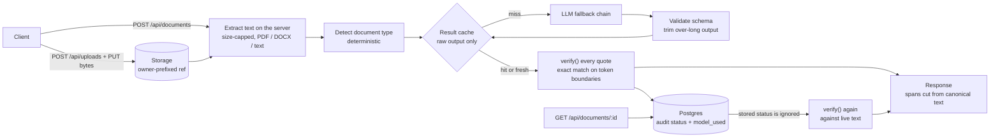
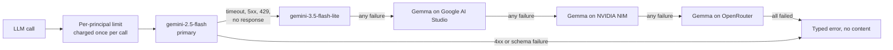

# Lawyer Up

**An AI legal assistant for tenants, employees and freelancers in India. It shows exactly where a
document says what it says, and it never marks a quote verified unless the server has just checked
it.**


> [!IMPORTANT]
> **Lawyer Up gives legal information, not legal advice.** It helps you read and compare documents
> and prepare for a conversation with a lawyer. It does not replace one. Findings carry no severity
> or priority ranking, and AI-written answers and explanations are labelled as AI-generated.

This repository is the **backend**: the domain core, data layer, LLM layer, multi-agent
orchestrator and HTTP API. The frontend is not built yet.

## What it does

| The problem | The feature | Where it lives |
|---|---|---|
| "I don't understand what this rental agreement commits me to." | **Understand.** Upload a PDF, DOCX or text. You get obligations, deadlines, penalties, ambiguities and missing clauses. Each finding quotes the document, verified word for word, and is explained from 2–4 reader perspectives, such as a tenant before or after signing. | [`services/understand.ts`](src/server/services/understand.ts), [`deterministic/extract/`](src/server/deterministic/extract/), [`prompts/understand/`](src/server/prompts/understand/) |
| "Can my landlord keep my deposit?" | **Ask.** Chat grounded in your documents, with verified citations, or general legal questions, clearly labelled. A non-LLM classifier routes each question to at most two specialists (tenancy, employment, contracts/NDA, privacy, freelance, general legal) and synthesizes their answers. Off-topic questions get a redirect without a model call. | [`services/ask.ts`](src/server/services/ask.ts), [`orchestrator/run-orchestrator.ts`](src/server/orchestrator/run-orchestrator.ts), [`orchestrator/classify.ts`](src/server/orchestrator/classify.ts) |
| "What changed between the draft and the final contract?" | **Compare.** Clause-by-clause alignment, done deterministically so no change is lost. One model call explains the changes, and each side's quote is verified against its own document. | [`services/compare.ts`](src/server/services/compare.ts), [`deterministic/segment.ts`](src/server/deterministic/segment.ts) |
| "What should I ask a lawyer before I sign?" | **Prepare.** Lawyer questions and a before-you-sign checklist, built only from verified findings, plus a deterministic Markdown export. | [`services/prepare.ts`](src/server/services/prepare.ts), [`prepare-export/markdown.ts`](src/server/deterministic/prepare-export/markdown.ts) |
| "I need to reply to this notice." | **Draft.** Five tuned document types plus a grounded response, written from scratch or grounded in an uploaded document, with a revision chain. Every section is labelled templated or AI-generated. | [`services/draft.ts`](src/server/services/draft.ts), [`draft-templates/registry.ts`](src/server/deterministic/draft-templates/registry.ts) |
| "Keep everything about my flat in one place." | **Projects.** An optional workspace per matter. Documents, comparisons, drafts and saved threads can be saved into one at any time. | [`data/projects.ts`](src/server/data/projects.ts), [`app/api/projects/`](src/app/api/projects/) |
| "I started as a guest; don't lose my work." | **Guest to account.** Everything except projects and saved threads works without signing in. On sign-in, guest documents, comparisons and drafts move to the account in one transaction, and a guest's saved chat is re-verified on import. | [`auth/session.ts`](src/server/auth/session.ts), [`auth/claim.ts`](src/server/auth/claim.ts), [`services/auth.ts`](src/server/services/auth.ts) |

Tuned document types: leave-and-license (rental), job offer letter, NDA, privacy policy, freelance
service agreement. Anything else is analysed as `generic`. More detail is in
[docs/PRODUCT.md](docs/PRODUCT.md).

## How verification works

The model claims text. Only server code decides whether that text is real and where it is. This
**One Guarantee** holds on every path:

- **Only `verify()` can issue `verified`.** It returns a branded `VerifyResult` that no other code
  can construct. Each result is bound to the exact quote, a hash of the document text and the
  document's input mode. Every repository that stores a status accepts only that type and
  re-checks the binding. ([ADR 0001](docs/adr/0001-branded-verify-result.md))
- **Spans are computed on the server.** The model returns quote text, never a position.
  - `verify()` finds an exact match on token boundaries, so "lawful" never verifies inside
    "unlawful".
  - The client is sent `canonical_text.slice(start, end)`, never the model's string.

  ([ADR 0002](docs/adr/0002-token-boundary-matching.md))
- **Every read re-verifies.** A stored status is an audit field that nothing trusts. Findings,
  citations and comparison changes are checked again against the live text on every read. The
  result cache stores raw model output only. A reopened guest chat re-verifies through
  `POST /api/verify-batch`. ([ADR 0003](docs/adr/0003-reverify-on-every-read.md))
- **Scanned documents are capped at `approximate`.** Their text is the model's own transcription,
  so `verify()` refuses to call it verified, and database triggers refuse to store it.
  ([ADR 0004](docs/adr/0004-native-document-cap.md))
- **The model's schema has no status field.** No response schema declares `status`, `verified` or
  a span. A guard throws before any provider call if one does, so even a successful prompt
  injection cannot certify itself. ([ADR 0006](docs/adr/0006-provider-schema-sanitization.md))

The guarantee is enforced across ten channels: model payload, streaming, orchestrator, model
fallback, errors, cache, general mode and drafts, span binding, persistence, and scanned documents.
Each channel has a positive and a negative test in the `verify` suite. A registry check fails if
any channel loses either one. See [docs/ARCHITECTURE.md](docs/ARCHITECTURE.md) for the
channel table.

## Pipeline



Every LLM call goes through one flat chain with one deadline. Each tier has its own circuit breaker:
three consecutive failures open it for 60 s; a provider 429 that names a per-day quota or a retry
delay opens it at once; a failed trial doubles the window, up to 10 minutes. The answering model is
recorded on every result
([ADR 0007](docs/adr/0007-flat-fallback-chain.md)):



## Quick start

Requires **Node 22.16+** and npm.

```bash
npm ci
cp .env.example .env    # every value may stay blank for local work
npm test                # the full suite: no API keys, no network, no services
npm run db:migrate      # creates the local PGlite database in .pglite/
npm run dev             # http://localhost:3000/api/health
```

**What works without any API key:**

| | Works keyless | Notes |
|---|---|---|
| `npm test` | Yes | Fakes sit only at the SDK boundary; a network guard fails any test that reaches a live host |
| `npm run db:migrate`, `npm run dev` | Yes | Guest-session and IP-hash secrets fall back to ephemeral per-process values outside production |
| `GET /api/health`, reads, `verify-batch`, the guest projects list | Yes | Health reports `degraded` and says which part is unconfigured |
| Uploads | Needs `LOCAL_STORAGE_SIGNING_SECRET` | At least 32 bytes, for example `openssl rand -hex 32` |
| `npm run validate:live -- understand --dry-run` | Yes | The whole live-validation pipeline over a fake model: zero provider calls, with a self-check |
| Analysis, Ask, Compare, Prepare, Draft | No | Need `GEMINI_API_KEY`, `NVIDIA_API_KEY` and `OPENROUTER_API_KEY`, because the fallback chain is built whole. Without them these routes fail with a configuration error before writing anything |

Every variable is listed in [`.env.example`](.env.example). Locally every request is a guest: the
user-only routes (creating projects, saving threads, save-to-project, claim) are exercised by tests
with constructed user principals.

## Testing

`npm test` runs **2,734 tests in 204 files** in about four minutes, against in-memory PGlite with the
real migrations applied. The database, `verify()`, repositories and services are never mocked;
only the provider SDKs are faked.

| Suite | Folder | Command | What it proves |
|---|---|---|---|
| Unit | [`tests/unit/`](tests/unit/) (mirrors `src/`) | `npm run test:unit` | Each module's contract, including the matcher's normalization and boundary rules, the fallback chain and the limiter math |
| Integration | [`tests/integration/routes/`](tests/integration/routes/) | `npm run test:integration` | Every route, driven through its real handler: status codes, wire contracts, SSE framing, no leaks in errors or logs |
| Property | [`tests/property/`](tests/property/) | `npm run test:property` | fast-check: `verify()` on adversarial text (long documents, punctuation, near-miss quotes), and storage-path traversal |
| Architecture | [`tests/architecture/`](tests/architecture/) | `npm run test:architecture` | Repo-wide static checks: the One-Guarantee channel registry, the wire-contract lint (no raw quotes, canonical text or storage refs; AI prose labelled), thin-route conventions, network-guard scope, no tests in `src/`, fixture integrity |
| **Release blocker: One Guarantee** | any path containing `verify` | `npm run test:verify` | 325 tests in 29 files: a positive and a negative test for each of the ten channels, plus the worst-case timing tests |
| **Release blocker: IDOR** | any path containing `idor` | `npm run test:idor` | 176 tests in 27 files: a foreign, missing or malformed id is the same 404 on every principal-scoped route, repository and service, with a positive control for the owner |
| **Release blocker: rate limit** | any path containing `rate-limit` | `npm run test:rate-limit` | 205 tests in 8 files: concurrent atomic increments on all three tiers, with no double count and no lost update |
| Live validation | [`tests/fixtures/live-validation/`](tests/fixtures/live-validation/) | `npm run validate:live -- <part>` | Real Gemini and Gemma calls against six curated documents with answer keys. **Never part of `npm test`**; it runs one part at a time under an explicit call budget |
| Coverage | — | `npm run test:coverage` | v8 coverage over `src/**`, thin API route adapters excluded (each is one call into a service function); enforces the thresholds in `vitest.config.ts` |

[CI](.github/workflows/ci.yml) runs lint, typecheck, the full test suite, the build and the coverage
check on every push and pull request, with no provider keys set and no `validate:live` call.

## Live validation results

The mocked suite proves that verification is wired correctly. [Live validation](docs/live-validation-report.md)
proves it holds on real model output. It was measured on free-tier models with small samples:

- **Understand**, on the primary `gemini-2.5-flash` with thinking off, across 5 of the 6 fixture
  documents:
  - **137 of 137 quotes verified** word for word;
  - **50 of 58** required answer-key clauses found (86%, or 84.5% on a strict reading);
  - every finding in an allowed category.
- **Ask, Compare and Draft**, almost entirely on the fallback `gemini-3.5-flash-lite`:
  - 6 of 6 grounded citations verified;
  - 8 of 8 injected Compare changes detected and explained;
  - 2 of 2 drafts complete.

  These are smoke tests, not benchmarks. Routing reached 24 of 30 (80%); it is deterministic and
  was measured locally.
- **Known weak spots**, all detailed in the report:
  - missing-clause detection found 3 of 7;
  - one fixture document and the current Prepare output are not yet measured;
  - the Gemma tiers have not answered for this account.

## Repository layout

```
src/
  app/api/              route handlers: thin adapters, one service call each
  server/
    services/           one module per feature: understand, ask, compare, prepare, draft, verify-batch, auth
    deterministic/      model-independent: extract, verify, segment, detect-type, draft-templates, prepare-export
    orchestrator/       non-LLM classifier, capped specialist fan-out, synthesis, citation verification
    llm/                LlmClient, Gemini and OpenAI-compatible adapters, fallback chain, circuit breakers
    prompts/            versioned prompts, pinned by hash
    rate-limit/         three-tier limiter and its LLM-client decorators
    data/               repositories and the canAccess chokepoint
    http/               route() wrapper, error mapping, SSE, wire views
    auth/  storage/     guest sessions and claim; the local filesystem storage adapter
    core/               typed errors, env access, shared types
  shared/contracts/     zod request and response contracts, shared with the tests
  db/                   Drizzle schema, migration runner, hand-written SQL migrations
  lib/                  client-side guest thread store
tests/                  unit/ integration/ property/ architecture/ support/ setup/ fixtures/
scripts/                db-migrate.ts, validate-live/, check-one-guarantee-coverage.ts, pg-race-claim.ts
docs/                   product, schema, API, architecture, ADRs, live-validation reports
```

## API

The full contract, with request and response schemas, error codes and streaming, is in
[docs/API.md](docs/API.md).

| Method | Path | Purpose |
|---|---|---|
| `POST` · `PUT` | `/api/uploads` · `/api/uploads/relay` | Get an upload target, then send the bytes |
| `POST` | `/api/documents` | Confirm an upload, extract, analyse, verify |
| `GET` | `/api/documents/:id` | A document with its findings, every quote re-verified |
| `POST` | `/api/documents/:id/analyze` | Retry an incomplete analysis (idempotent) |
| `POST` | `/api/documents/:id/prepare` | Lawyer questions, checklist and Markdown export |
| `POST` | `/api/ask` | One unsaved chat turn, streamed |
| `POST` · `GET` | `/api/threads` · `/api/threads/:id/messages` | Save or import a thread; send and list its messages |
| `POST` · `GET` | `/api/comparisons` · `/api/comparisons/:id` | Compare two documents; read a comparison |
| `POST` · `GET` | `/api/drafts` · `/api/drafts/:id` · `/api/drafts/:id/revise` | Draft, read, revise |
| `POST` · `GET` | `/api/projects` · `/api/projects/:id` | Create, list and read projects |
| `POST` | `/api/{documents,comparisons,drafts,threads}/:id/save-to-project` | Save an item into a project |
| `POST` | `/api/verify-batch` | Fresh statuses for a reopened guest chat |
| `POST` | `/api/auth/claim` | Move a guest's work to the signed-in account |
| `GET` | `/api/health` | Configuration health, with no model call |

## Security

- **Identity.** Identity comes only from an httpOnly, HMAC-signed guest cookie holding a CSPRNG
  session id, or from the auth adapter. It never comes from a header or the request body.
  ([ADR 0009](docs/adr/0009-identity-and-authorization.md))
- **Authorization.**
  - Every repository call passes through one `canAccess` chokepoint.
  - An operation that links entities checks every one of them.
  - A resource that belongs to someone else returns the **same 404** as a missing or malformed
    id, never a 403.
- **Cross-site requests.** A state-changing request marked `Sec-Fetch-Site: cross-site` is refused
  before any cookie is read. JSON bodies must be sent as `application/json`.
- **Rate limits.** There are three tiers: per principal per LLM call, per IP on every route, and
  global per provider. Each is an atomic database upsert.
  ([ADR 0005](docs/adr/0005-three-tier-rate-limiting.md))
- **No raw model text on the wire.**
  - Response contracts strip undeclared keys.
  - A verified passage is cut from the document's own text.
  - A contract lint fails the test suite if a response could carry a raw quote, canonical text or
    a storage ref.
  - AI-written fields carry a provenance label. Streamed tokens are an unlabelled live preview;
    the final message carries the label.
- **Errors and logs.**
  - Error messages are fixed for each code. No stack trace, SQL statement or environment value
    reaches a response or an app log line.
  - Failures carry a correlation id.
  - Client IPs are stored only as HMACs.
  - A missing secret is reported by its variable name, never its value.
- **Uploads.**
  - Uploads pass a MIME allowlist and byte, page and decompression caps.
  - Storage refs are owner-prefixed and parsed as hostile input.
  - Document text is always extracted on the server from the stored bytes.
- **Production database.** App tables receive no Data API grants. A prod-only migration revokes
  them and asserts that none survive.

## Status and limitations

- **Backend only.** There is no frontend, and `src/app/page.tsx` is a placeholder. Nothing is
  deployed.
- **Local adapters only.** Locally the app runs on PGlite, the filesystem and guest-only auth. The
  Supabase Storage and Auth adapters are not written yet. The prod-only migrations (Data API
  revokes, the `pg_cron` TTL sweep) have not been applied to a live project. Project-scoped
  retrieval (`document_embeddings`) is pending pgvector support.
- **Free-tier quotas.** The free tier allows about 20 requests per model per day, which cannot serve
  a demo. The working fallback today is the second Gemini model.
- **Known verification edge.** A PDF whose text layer came from third-party OCR, or that carries
  invisible text, extracts as ordinary text and can reach `verified`.
- **Scope.** English only, national-level (India) jurisdiction only.

## Documentation

- [Product scope](docs/PRODUCT.md): pillars, principles, what is out of scope, quality bars
- [Architecture](docs/ARCHITECTURE.md): the One Guarantee, system context, layers, key flows
- [Architecture decision records](docs/adr/README.md)
- [Data model](docs/SCHEMA.md)
- [HTTP API](docs/API.md)
- [Live-validation report](docs/live-validation-report.md) and the [per-feature runs](docs/live-validation/)
