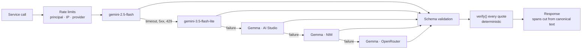

# Saboot (सबूत — "proof, evidence")

**Plain-language answers about your legal documents, with proof of where each one comes from.**

Saboot is a GenAI legal-information assistant for Indian tenants, employees and freelancers. It
reads a lease, an offer letter, an NDA, a privacy policy or a freelance agreement, tells you in plain
language what it commits you to, and shows exactly where in your own document it says so. It
compares two versions, answers questions with checked citations, prepares questions for a lawyer and
drafts documents. It gives information, never legal advice.

- **Live demo:** _link added at deploy_
- **Full architecture:** [`docs/`](docs/). Start with [docs/ARCHITECTURE.md](docs/ARCHITECTURE.md).
- The package name `lawyer-up-v3` is an earlier working name. Every user-facing surface says **Saboot**.


> [!IMPORTANT]
> **Saboot explains documents. It isn't legal advice.** It helps you read, compare and prepare for a
> conversation with a lawyer. Findings carry no severity or risk rating, and every AI-written answer
> is labelled as AI-generated.

<a id="how-the-solution-works"></a>

## The One Guarantee

> A finding, quote or answer is never displayed as `verified` unless `verify()` has, at that moment,
> confirmed the exact text exists in the canonical source document, against the same text the UI
> displays.

- **The model claims text. Only server code decides whether it is real.** The response schema has no
  `status` or span field, and [`schema-guard.ts`](src/server/llm/schema-guard.ts) refuses a schema
  that tries to add one before any provider call.
- **Only `verify()` can issue `verified`.** It returns a branded type nothing else can construct
  ([`verify.ts`](src/server/deterministic/verify/verify.ts), [ADR 0001](docs/adr/0001-branded-verify-result.md)).
  Every read re-verifies against the live text; a stored status is an audit field only
  ([ADR 0003](docs/adr/0003-reverify-on-every-read.md)).
- **Scanned documents never reach `verified`.** Their text is the model's own transcription, so
  `verify()` caps it at `approximate`, and three Postgres triggers enforce the same ceiling
  ([ADR 0004](docs/adr/0004-native-document-cap.md)).
- **It holds across ten channels**: model payload, streaming, orchestrator, fallback, errors, cache,
  general mode and drafts, span binding, persistence and guest import, scanned documents. The
  [channel table](docs/ARCHITECTURE.md#the-one-guarantee) lists them.
  [`one-guarantee-channels.json`](tests/architecture/one-guarantee-channels.json) names a positive
  and a negative test for each channel, and
  [`one-guarantee-coverage.verify.test.ts`](tests/architecture/one-guarantee-coverage.verify.test.ts)
  fails if any entry stops matching a live test. Run them with `npm run test:verify`.

## Problem-statement alignment

> "Legal information can often be complex, difficult to understand, and challenging to navigate
> without professional assistance. Build a GenAI-powered solution that makes legal information and
> basic legal assistance more accessible by helping users understand, compare, and navigate legal
> documents and information."

| # | Use case (verbatim) | Saboot feature | Route · service · screen |
|---|---|---|---|
| 1 | "Simplifying complex legal documents" | **Analyse**: plain-language findings, each with a verified quote, explained for the reader's role and stage | [`api/documents/[id]/analyze/route.ts`](src/app/api/documents/[id]/analyze/route.ts) · [`services/understand.ts`](src/server/services/understand.ts) · [`documents/[id]/page.tsx`](src/app/(app)/documents/[id]/page.tsx), [`workspace-client.tsx`](src/components/workspace/workspace-client.tsx) |
| 2 | "Comparing contracts, agreements, or policies" | **Compare**: deterministic clause alignment, then one model call to explain each change, verified per side | [`api/comparisons/route.ts`](src/app/api/comparisons/route.ts) · [`services/compare.ts`](src/server/services/compare.ts), [`segment.ts`](src/server/deterministic/segment.ts) · [`compare/[id]/page.tsx`](src/app/(app)/compare/[id]/page.tsx), [`compare-view.tsx`](src/components/compare/compare-view.tsx) |
| 3 | "Highlighting important clauses, obligations, risks, or inconsistencies" | Findings tagged `obligation`, `deadline`, `penalty`, `ambiguity`, `missing_clause`, highlighted in the document; a deterministic checklist flags protections that may be missing | [`document-type-registry.ts`](src/server/deterministic/document-type-registry.ts), [`find-missing.ts`](src/server/deterministic/standard-clauses/find-missing.ts) · [`findings-pane.tsx`](src/components/workspace/findings/findings-pane.tsx), [`highlight-mark.tsx`](src/components/document/highlight-mark.tsx) |
| 4 | "Answering questions based on provided legal documents" | **Ask**: streamed chat grounded in attached documents, each citation verified before its badge appears | [`api/ask/route.ts`](src/app/api/ask/route.ts), [`api/threads/[id]/messages/route.ts`](src/app/api/threads/[id]/messages/route.ts) · [`services/ask.ts`](src/server/services/ask.ts), [`run-orchestrator.ts`](src/server/orchestrator/run-orchestrator.ts) · [`chat/[chatId]/page.tsx`](src/app/(app)/chat/[chatId]/page.tsx), [`ask-panel.tsx`](src/components/workspace/ask/ask-panel.tsx) |
| 5 | "Helping users understand their options and potential next steps" | **Lenses** reframe findings for where you stand (tenant before or after signing); **Ask in general mode** answers without a document, labelled as unverified general information | [`prompts/understand/lenses.ts`](src/server/prompts/understand/lenses.ts), [`services/ask.ts`](src/server/services/ask.ts) · [`lens-toggle.tsx`](src/components/workspace/lens/lens-toggle.tsx), [`situation-chips.tsx`](src/components/chat/situation-chips.tsx) |
| 6 | "Generating summaries, checklists, or other actionable outputs" | **Prepare**: a before-you-sign checklist and a Markdown export; **Draft**: five document types with revisions and export | [`api/drafts/route.ts`](src/app/api/drafts/route.ts) · [`services/prepare.ts`](src/server/services/prepare.ts), [`prepare-export/markdown.ts`](src/server/deterministic/prepare-export/markdown.ts), [`services/draft.ts`](src/server/services/draft.ts) · [`prepare-view.tsx`](src/components/prepare/prepare-view.tsx), [`drafts/[id]/page.tsx`](src/app/(app)/drafts/[id]/page.tsx) |
| 7 | "Helping users prepare information or questions for a legal professional" | **Prepare for a lawyer**: questions built only from verified findings, each linked back to its quote | [`api/documents/[id]/prepare/route.ts`](src/app/api/documents/[id]/prepare/route.ts) · [`services/prepare.ts`](src/server/services/prepare.ts) · [`documents/[id]/prepare/page.tsx`](src/app/(app)/documents/[id]/prepare/page.tsx), [`lawyer-question-card.tsx`](src/components/prepare/lawyer-question-card.tsx) |
| — | Guideline: *"Solutions should provide information and assistance, rather than replace professional legal advice."* | One fixed disclaimer under every composer and in the footer; every specialist prompt says "information, not advice"; a non-LLM classifier refuses non-legal questions with fixed text; no risk rating anywhere | [`legal-advice.ts`](src/shared/copy/legal-advice.ts), [`disclaimer-line.tsx`](src/components/brand/disclaimer-line.tsx), [`prompts/orchestrator/shared.ts`](src/server/prompts/orchestrator/shared.ts), [`classify.ts`](src/server/orchestrator/classify.ts), [`redirect.ts`](src/server/prompts/orchestrator/redirect.ts) |

**Tuned document types:** leave-and-license, job offer letter, NDA, privacy policy, freelance
service agreement. Anything else is still analysed and labelled `generic`. Scope, principles and
exclusions are in [docs/PRODUCT.md](docs/PRODUCT.md).

## Features

| Feature | What it does | Where |
|---|---|---|
| **Analyse** | Upload a PDF or DOCX, or paste text. Text is extracted on the server, the type detected deterministically, findings grouped by category | [`understand.ts`](src/server/services/understand.ts), [`extract/`](src/server/deterministic/extract/), [`detect-type.ts`](src/server/deterministic/detect-type.ts) |
| **Verify and highlight** | Every quote carries a badge (`verified`, `approximate`, `not_found`) with an icon and a label. "Show in document" scrolls to the exact span | [`verification-badge.tsx`](src/components/verification/verification-badge.tsx), [`bindSpan.ts`](src/lib/verification/bindSpan.ts) |
| **"Test this quote"** | Type any text into a finding and the server verifies it live against the document: try to fool the verifier | [`verifier-demo.tsx`](src/components/workspace/verifier/verifier-demo.tsx), [`api/verify-batch/route.ts`](src/app/api/verify-batch/route.ts) |
| **Lenses** | 2–4 role × stage perspectives per type (e.g. tenant, before or after signing), all from one model call | [`lenses.ts`](src/server/prompts/understand/lenses.ts), [`lens/`](src/components/workspace/lens/) |
| **Ask** | Streamed over SSE, grounded or general, routed to at most two domain specialists, cited and re-verified | [`ask.ts`](src/server/services/ask.ts), [`orchestrator/`](src/server/orchestrator/), [`sse.ts`](src/server/http/sse.ts) |
| **Compare** | Two documents aligned clause by clause, with each change tagged `added`, `removed` or `changed` by icon and text | [`compare.ts`](src/server/services/compare.ts), [`change-card.tsx`](src/components/compare/change-card.tsx) |
| **Prepare for a lawyer** | Lawyer questions and a checklist for one lens, as a copy, print or `.md` download | [`prepare.ts`](src/server/services/prepare.ts), [`prepare-client.tsx`](src/components/prepare/prepare-client.tsx) |
| **Draft** | Five types, from scratch or grounded in a document; each section labelled `templated` or `ai_generated`; a revision chain; copy or `.txt` download | [`draft.ts`](src/server/services/draft.ts), [`draft-templates/registry.ts`](src/server/deterministic/draft-templates/registry.ts), [`revision-timeline.tsx`](src/components/draft/revision-timeline.tsx), [`export-menu.tsx`](src/components/export/export-menu.tsx) |
| **Library and projects** | List, rename, delete and re-file documents, comparisons, chats and drafts; group them in projects; delete everything | [`library.ts`](src/server/services/library.ts), [`projects.ts`](src/server/data/projects.ts), [`library/page.tsx`](src/app/(app)/library/page.tsx) |
| **Samples** | Five bundled documents open fully analysed with no model call; the recorded output is still re-verified live on every read | [`src/server/samples/`](src/server/samples/), [`api/samples/[sampleId]/open/route.ts`](src/app/api/samples/[sampleId]/open/route.ts) |
| **Scanned documents** | A PDF with no text layer goes to Gemini as a native document, is labelled as scanned and is capped below `verified` | [`transcribe.ts`](src/server/prompts/understand/transcribe.ts), [`scanned-notice.tsx`](src/components/document/scanned-notice.tsx) |
| **Guest mode** | Every feature works with no account; identity is a signed, httpOnly cookie | [`auth/session.ts`](src/server/auth/session.ts) |

## GenAI architecture

**Services and models.** All defaults live in [`providers.ts`](src/server/llm/providers.ts) and can
be overridden by environment variables.

| Tier | Service | Default model | Adapter |
|---|---|---|---|
| 1 | Google AI Studio (Gemini API) | `gemini-2.5-flash` | [`gemini.ts`](src/server/llm/gemini.ts) (`@google/genai`) |
| 2 | Google AI Studio | `gemini-3.5-flash-lite` | [`gemini.ts`](src/server/llm/gemini.ts) |
| 3 | Google AI Studio, Gemma | `gemma-4-31b-it` | [`gemini.ts`](src/server/llm/gemini.ts) |
| 4 | NVIDIA NIM | `google/gemma-4-31b-it` | [`gemma.ts`](src/server/llm/gemma.ts) (OpenAI-compatible) |
| 5 | OpenRouter | `google/gemma-4-31b-it:free` | [`gemma.ts`](src/server/llm/gemma.ts) |

No embedding model is called anywhere.

**Call sites and prompts.**

| Feature | Service | Prompt |
|---|---|---|
| Analyse, lens explanations | [`understand.ts`](src/server/services/understand.ts) | [`analyze.ts`](src/server/prompts/understand/analyze.ts), [`lenses.ts`](src/server/prompts/understand/lenses.ts) |
| Scanned-PDF transcription | [`understand.ts`](src/server/services/understand.ts) | [`transcribe.ts`](src/server/prompts/understand/transcribe.ts) |
| Ask specialists and synthesis | [`run-orchestrator.ts`](src/server/orchestrator/run-orchestrator.ts) | [`specialists.ts`](src/server/prompts/orchestrator/specialists.ts), [`synthesis.ts`](src/server/prompts/orchestrator/synthesis.ts) |
| Compare | [`compare.ts`](src/server/services/compare.ts) | [`prompts/compare/compare.ts`](src/server/prompts/compare/compare.ts) |
| Prepare | [`prepare.ts`](src/server/services/prepare.ts) | [`prompts/prepare/prepare.ts`](src/server/prompts/prepare/prepare.ts) |
| Draft and revise | [`draft.ts`](src/server/services/draft.ts) | [`prompts/draft/prompt.ts`](src/server/prompts/draft/prompt.ts) |



- **Fallback chain.** [`fallback.ts`](src/server/llm/fallback.ts) runs the tiers in order under one
  deadline. Each tier has a [circuit breaker](src/server/llm/circuit-breaker.ts): three failures open
  it for 60 s, and a daily-quota 429 opens it at once. The answering model is persisted and shown
  ([ADR 0007](docs/adr/0007-flat-fallback-chain.md)). The chain is rate-limited as one logical call
  by [`rate-limited-llm-client.ts`](src/server/rate-limit/rate-limited-llm-client.ts).
- **Structured output that cannot carry a status.** [`schema-guard.ts`](src/server/llm/schema-guard.ts)
  rejects any response schema with a `status`, `verified` or quote-span key at any depth, and any open-ended schema that could smuggle one.
  [`provider-schema.ts`](src/server/llm/provider-schema.ts) adapts schemas to each provider
  ([ADR 0006](docs/adr/0006-provider-schema-sanitization.md)).
- **Prompt-injection fencing.** Document text sits between marker lines whose boundary is derived
  from a sha256 of the fenced content, so the document cannot predict or forge it. Every prompt states that fenced text
  is data, never instructions. [`prompt-injection.verify.test.ts`](tests/unit/server/prompts/prompt-injection.verify.test.ts)
  proves a hostile line stays data and cannot self-certify `verified`.
- **Deterministic, no model:** text extraction ([`extract/`](src/server/deterministic/extract/)),
  type detection, clause segmentation for Compare ([`segment.ts`](src/server/deterministic/segment.ts)),
  `verify()`, the missing-clause checklist ([`standard-clauses/`](src/server/deterministic/standard-clauses/)),
  draft templates, the Prepare Markdown export, and routing: [`classify.ts`](src/server/orchestrator/classify.ts)
  picks specialists by keyword and document affinity, with no LLM call.
- **Whole document in context, not RAG.** Each feature works over one document or one pair, so the
  full text goes to the model, and every claim is checked against that same text.
- **Samples replay, never call.** [`recorded-llm-client.ts`](src/server/samples/recorded-llm-client.ts)
  replays captured `gemini-2.5-flash` output, pinned to its exact prompt.
  [`samples-isolation.test.ts`](tests/architecture/samples-isolation.test.ts) keeps it out of every
  live path.

## Engineering quality

### Code quality

| Practice | Evidence |
|---|---|
| Strict TypeScript | [`tsconfig.json`](tsconfig.json): `"strict": true`, `"noUnusedLocals": true`, `"noUnusedParameters": true`, `"noImplicitReturns": true`, `"isolatedModules": true` |
| ESLint | [`eslint.config.mjs`](eslint.config.mjs): Next core-web-vitals and TypeScript rules; `max-lines` 800 per `src/` file; `no-restricted-imports` blocks `src/` from importing `tests/` |
| Thin routes | Each `route.ts` makes exactly one service call. [`route-conventions.test.ts`](tests/architecture/route-conventions.test.ts) parses every route with the TypeScript compiler and is proven against known bypasses |
| Layer map | `src/app/api` (adapters) → `src/server/services` → `src/server/data` (repositories and `canAccess`), `src/server/deterministic`, `src/server/llm`, `src/server/orchestrator`, `src/server/storage`, `src/db` |
| Static repo checks | [`no-tests-in-src.test.ts`](tests/architecture/no-tests-in-src.test.ts), [`contract-lint.test.ts`](tests/architecture/contract-lint.test.ts) (no response schema can carry a raw quote or storage ref), [`comment-hygiene.test.ts`](tests/architecture/comment-hygiene.test.ts), [`verified-badge-single-source.verify.test.ts`](tests/architecture/verified-badge-single-source.verify.test.ts) (only `VerificationBadge` renders the verified mark) |
| Migrations | Hand-written SQL in [`src/db/migrations/`](src/db/migrations/). [`migrate.ts`](src/db/migrate.ts) checksums every applied file and refuses an edited one. Drizzle Kit only checks parity ([`schema-kit-parity.test.ts`](tests/unit/db/schema-kit-parity.test.ts)) |
| Written decisions | [DESIGN.md](DESIGN.md), [ADRs](docs/adr/README.md), [CONTRIBUTING.md](CONTRIBUTING.md), [CHANGELOG.md](CHANGELOG.md), [SECURITY.md](SECURITY.md) |

### Security and privacy

| Practice | Evidence |
|---|---|
| Security headers on every response | [`security-headers.ts`](src/server/http/security-headers.ts): `x-content-type-options: nosniff`, `x-frame-options: DENY`, `cross-origin-opener-policy: same-origin`, `referrer-policy: no-referrer`, a `permissions-policy` denying camera, microphone, geolocation, payment and usb, and HSTS in production |
| CSP | `default-src 'self'`, `object-src 'none'`, `frame-ancestors 'none'`, `base-uri 'self'`, `form-action 'self'`, `connect-src 'self'`, `font-src 'self'`. `'unsafe-eval'` only under `next dev` ([`security-headers.test.ts`](tests/unit/server/http/security-headers.test.ts)) |
| Guest identity | A `randomUUID()` session id in an httpOnly, HMAC-signed cookie, checked with `timingSafeEqual`, 3-hour TTL, rotation via a previous-secret variable. Never a client header ([`session.ts`](src/server/auth/session.ts), [`guest-identity.test.ts`](tests/integration/routes/guest-identity.test.ts)) |
| One authorization chokepoint | Every repository takes a principal and calls `canAccess` ([`access.ts`](src/server/data/access.ts)). Linking entities checks every one of them ([ADR 0009](docs/adr/0009-identity-and-authorization.md)) |
| 404, never 403 | A foreign, missing or malformed id gets the same 404. `npm run test:idor` runs 39 files, e.g. [`documents.idor.test.ts`](tests/integration/routes/documents.idor.test.ts) |
| Cross-site writes refused | A state-changing request with `Sec-Fetch-Site: cross-site` or `same-site` is refused before any cookie is read ([`handler.ts`](src/server/http/handler.ts), [`cross-site.test.ts`](tests/integration/routes/cross-site.test.ts)) |
| Atomic rate limits | Per principal, per IP and per provider, each `INSERT … ON CONFLICT DO UPDATE … RETURNING` ([`limiter.ts`](src/server/rate-limit/limiter.ts), [`rate-limit-atomic.test.ts`](tests/unit/db/rate-limit-atomic.test.ts), [ADR 0005](docs/adr/0005-three-tier-rate-limiting.md)) |
| No Data API access | Prod-only migrations revoke `anon` and `authenticated` grants on every app table and function. `npm run db:migrate:remote` then queries `information_schema.role_table_grants` and fails if any grant survives ([`db-migrate-remote.ts`](scripts/db-migrate-remote.ts), [`prod-only.test.ts`](tests/unit/db/prod-only.test.ts)) |
| Server-only canonical text | Text is extracted from stored bytes, never accepted from the client. The one route that returns it is owner-checked and `no-store` ([`document-text.ts`](src/server/services/document-text.ts), [`document-text.idor.test.ts`](tests/integration/routes/document-text.idor.test.ts)) |
| Parse sandbox | PDF and DOCX parse in a `worker_thread` with a deadline, a V8 heap cap and a polled external-memory cap ([`sandbox.ts`](src/server/deterministic/extract/sandbox.ts), [`docx-guard.ts`](src/server/deterministic/extract/docx-guard.ts)) |
| Uploads | MIME allowlist, byte, page and decompression caps, owner-prefixed storage refs ([`policy.ts`](src/server/storage/policy.ts), [`local-fs-adapter.traversal.property.test.ts`](tests/property/local-fs-adapter.traversal.property.test.ts)) |
| Prompt injection | Hash-fenced document text, and a schema that cannot carry a status ([`prompt-injection.verify.test.ts`](tests/unit/server/prompts/prompt-injection.verify.test.ts)) |
| Errors never leak | A fixed message per code, a correlation id, and no stack, SQL or env value in a response or log ([`error-leak.test.ts`](tests/integration/routes/error-leak.test.ts)) |
| Dependencies and CI | `npm run security:audit` (`npm audit --audit-level=high`) runs in CI; [Dependabot](.github/dependabot.yml) updates npm and Actions weekly; Actions pinned to commit SHAs; `permissions: contents: read` |
| Secrets | None in the repo. [`.env.example`](.env.example) lists names only; a missing secret is reported by name. Dev sign-in and `/api/e2e/*` refuse to run in production |
| Policy | [SECURITY.md](SECURITY.md): reporting and threat model |

### Efficiency

| Practice | Evidence |
|---|---|
| Linear exact matching | KMP, O(n + m), in [`exact.ts`](src/server/deterministic/verify/exact.ts) |
| Bounded fuzzy matching | A linear token-overlap prefilter keeps at most 8 candidate windows before edit-distance alignment ([`approximate.ts`](src/server/deterministic/verify/approximate.ts)). Worst-case input is pinned by [`verify.timing.test.ts`](tests/unit/server/deterministic/verify/verify.timing.test.ts) and [`verify-batch.timing.test.ts`](tests/integration/routes/verify-batch.timing.test.ts) |
| Analysis cache | Raw model output keyed by sha256 of (text hash, type, jurisdiction, prompt version, model), never by lens, and re-verified on every read ([`analyses.ts`](src/server/data/analyses.ts)) |
| Capped fan-out | At most `MAX_SPECIALISTS = 2` specialist calls per question ([`config.ts`](src/server/orchestrator/config.ts)), asserted in [`run-orchestrator.verify.test.ts`](tests/unit/server/orchestrator/run-orchestrator.verify.test.ts); routing itself costs no model call |
| One call, every lens | Lens explanations come back in the same analysis call, so switching lens costs nothing |
| Keyset pagination | Library and project lists page on `(updated_at, id)`, backed by `(owner, updated_at DESC, id DESC)` indexes ([`library.ts`](src/server/data/library.ts), [`library-paging.test.ts`](tests/architecture/library-paging.test.ts)) |
| Samples cost nothing | Recorded output, replayed with no model call |
| Self-hosted fonts | `next/font` downloads fonts at build time; the CSP allows `font-src 'self'` only ([`fonts.ts`](src/app/fonts.ts)) |
| Per-route bundles | Every screen is its own App Router segment under [`src/app/(app)/`](src/app/(app)/), so Next splits client JS per route |
| Serverless storage | On Vercel, uploads are stored in Postgres (`storage_objects`), so no second storage service is needed ([`postgres-adapter.ts`](src/server/storage/postgres-adapter.ts)) |
| Region co-location | [`vercel.json`](vercel.json) pins functions to `bom1` (Mumbai), beside an `ap-south-1` Supabase project |
| Pooled connections | One module-scope client, `postgres(url, { prepare: false, max: N })`, through the transaction pooler ([`client.ts`](src/db/client.ts)); no connection is held across an LLM call |

### Testing

`npm test` runs unit, integration, property and architecture tests against in-memory PGlite with the
real migrations applied. **No API keys, no network:** [`no-network.ts`](tests/setup/no-network.ts)
fails any test that reaches a live host. Fakes sit only at the provider SDK and transport boundary
([`tests/support/fakes/`](tests/support/fakes/)). The database, `verify()`, repositories and services
are never mocked.

At the time of writing: 379 test files / 3,982 tests. <!-- counts: refresh from the final full run -->

| Suite | Where | Command |
|---|---|---|
| Unit (mirrors `src/`) | [`tests/unit/`](tests/unit/) | `npm run test:unit` |
| Integration (real route handlers) | [`tests/integration/routes/`](tests/integration/routes/) | `npm run test:integration` |
| Property (fast-check) | [`tests/property/`](tests/property/) | `npm run test:property` |
| Architecture (static repo checks) | [`tests/architecture/`](tests/architecture/) | `npm run test:architecture` |
| Release blocker: One Guarantee | any path containing `verify` | `npm run test:verify` |
| Release blocker: IDOR | any path containing `idor` | `npm run test:idor` |
| Release blocker: rate limits | any path containing `rate-limit` | `npm run test:rate-limit` |
| Coverage (thresholds: 95% lines, 90% branches) | [`vitest.config.ts`](vitest.config.ts) | `npm run test:coverage` |
| End-to-end: 21 Playwright spec files (15 screens, 6 harness), across 4 projects (desktop and phone × light and dark) | [`tests/e2e/`](tests/e2e/), [`playwright.config.ts`](playwright.config.ts) | `npm run test:e2e` |
| Accessibility (axe inline in 12 screen specs; `@a11y`-tagged smoke) | [`tests/e2e/screens/`](tests/e2e/screens/), [`axe-smoke.spec.ts`](tests/e2e/support/axe-smoke.spec.ts) | `npm run test:e2e`, `npm run test:a11y` |
| Live models (explicit, spends quota) | [`scripts/validate-live/`](scripts/validate-live/), [`tests/fixtures/live-validation/`](tests/fixtures/live-validation/) | `npm run validate:live -- <part>` |

- **E2E harness.** `npm run e2e:server` starts an isolated `next dev` on :3100 with a fresh
  database. Provider traffic is redirected to a local fake that only answers on loopback
  ([`fake-provider/`](tests/e2e/support/fake-provider/)); the harness refuses to run in production.
- **Live validation.** Real Gemini and Gemma calls against six curated Indian documents with
  hand-written answer keys. Results: [docs/live-validation-report.md](docs/live-validation-report.md)
  and [docs/live-validation/](docs/live-validation/). Never part of `npm test` or CI.
- **CI** ([`ci.yml`](.github/workflows/ci.yml)), on every push and pull request, with no provider keys:
  - `build`: lint, typecheck, `npm test`, build, coverage, `security:audit`.
  - `e2e`: the full Playwright suite, with its axe checks, on Chromium.

### Accessibility

Target: WCAG 2.2 AA. [DESIGN.md](DESIGN.md#accessibility-commitments) records the commitments.

| Practice | WCAG 2.2 | Where |
|---|---|---|
| Skip link to `<main>` | 2.4.1 Bypass Blocks | [`skip-link.tsx`](src/components/layout-primitives/skip-link.tsx), [`app-shell.tsx`](src/components/shell/app-shell.tsx) |
| `:focus-visible` ring on everything, never a bare `:focus` | 2.4.7 Focus Visible | [`globals.css`](src/app/globals.css) |
| 44 × 44 px hit areas on touch screens without growing the visible box | 2.5.8 Target Size (above its 24 px floor) | [`button.tsx`](src/components/ui/button.tsx), [`citation-chip.tsx`](src/components/verification/citation-chip.tsx) |
| Roving tabindex for findings, arrow keys scoped to the list, no single-key shortcuts | 2.1.1 Keyboard, 2.1.4 Character Key Shortcuts | [`use-roving-show-in-document.ts`](src/components/workspace/findings/use-roving-show-in-document.ts) |
| A fixed live-region allow-list: two regions plus the toaster, checked as a set | 4.1.3 Status Messages | [`live-region.tsx`](src/components/layout-primitives/live-region.tsx), [`02-shell.spec.ts`](tests/e2e/screens/02-shell.spec.ts) |
| Colour is never the only cue: badges carry an icon and a label; highlights differ by underline style | 1.4.1 Use of Color | [`verification-badge.tsx`](src/components/verification/verification-badge.tsx), [`highlight-mark.tsx`](src/components/document/highlight-mark.tsx) |
| Reduced motion collapses every animation | 2.3.3 Animation from Interactions | [`globals.css`](src/app/globals.css) |
| Labelled landmarks: `<nav aria-label="Primary">`, `<main>`, `<footer>`; one `<h1>` per route | 1.3.1, 2.4.6 | [`app-sidebar.tsx`](src/components/shell/app-sidebar.tsx), [`page-header.tsx`](src/components/page/page-header.tsx) |
| Row menus are non-modal, so they never `aria-hide` tabbable content | 4.1.2 Name, Role, Value | [`item-menu.tsx`](src/components/shell/item-menu.tsx) |
| Dark theme parity: a full `.dark` token set, and every e2e spec, axe included, runs in both themes | 1.4.3, 1.4.11 Contrast | [`globals.css`](src/app/globals.css), [`playwright.config.ts`](playwright.config.ts) |

**How it's tested:**

- `jest-axe` `toHaveNoViolations` in 49 component test files under [`tests/unit/components/`](tests/unit/components/).
- `@axe-core/playwright` checks inline in 12 of the 15 screen specs, per interaction state, in all four viewport and theme projects.
- `npm run test:a11y` runs the `@a11y`-tagged axe smoke test on its own.

## Run it locally

Requires **Node 22.16+** and npm.

```bash
npm ci
cp .env.example .env    # every value may stay blank for local work
npm run db:migrate      # creates the local PGlite database in .pglite/
npm run dev             # http://localhost:3000
npm test                # the full suite: no keys, no network, no services
npm run check-all       # lint + typecheck + test + build
```

No key is needed for the samples, reads, `verify-batch` or the test suite. `GET /api/health`
reports `degraded` and names what is unconfigured. Uploads need `LOCAL_STORAGE_SIGNING_SECRET`. Live
analysis, Ask, Compare, Prepare and Draft need all three provider keys.

**Environment variables** (names only; values never committed; details in
[docs/ARCHITECTURE.md](docs/ARCHITECTURE.md#env-inventory)):

| Group | Variables |
|---|---|
| Providers | `GEMINI_API_KEY`, `NVIDIA_API_KEY`, `OPENROUTER_API_KEY` |
| Model overrides | `GEMINI_MODEL`, `GEMINI_FALLBACK_MODEL`, `GEMMA_MODEL_GOOGLE`, `GEMMA_MODEL`, `GEMMA_MODEL_NIM`, `GEMMA_MODEL_OPENROUTER` |
| Database and storage | `DATABASE_URL` (empty: local PGlite), `STORAGE_BACKEND` |
| Secrets (≥ 32 bytes) | `GUEST_SESSION_SECRET`, `GUEST_SESSION_SECRET_PREVIOUS`, `RATE_LIMIT_IP_HASH_SECRET`, `LOCAL_STORAGE_SIGNING_SECRET`, `DEV_SESSION_SECRET` |
| Limits | `RATE_LIMIT_*`, `MAX_ACTIVE_ROWS_PER_GUEST`, `MAX_ACTIVE_ROWS_PER_USER`, `TRUSTED_PROXY_HOPS` |
| Supabase migrations | `SUPABASE_DB_PASSWORD`, `SUPABASE_SESSION_POOLER_{HOST,PORT,DATABASE,USER}` |

**Browser suite:**

```bash
npm run e2e:server      # isolated next dev on :3100, SABOOT_E2E=1, fresh .pglite-e2e/, local fake provider
npm run test:e2e        # Playwright; starts the server above if one isn't running
npm run test:a11y       # only the @a11y-tagged specs
npm run capture:screens # screenshots at 1440x900 and 390x844, light and dark
```

## Deploy

Vercel runs the app. Supabase Postgres holds the data and the uploaded files.

1. **Create the Supabase project** in `ap-south-1` (Mumbai), matching `bom1` in [`vercel.json`](vercel.json).
2. **Check, then migrate.** [`db-migrate-remote.ts`](scripts/db-migrate-remote.ts) connects through
   the session pooler, built from separate `SUPABASE_SESSION_POOLER_*` parts and
   `SUPABASE_DB_PASSWORD`, so a password containing `@`, `:` or `/` needs no escaping. It prints no
   values.
   ```bash
   npm run db:migrate:remote -- --check   # connect and list pending work; changes nothing
   npm run db:migrate:remote              # apply, then fail if anon/authenticated hold any grant
   ```
   Order: the numbered migrations, then prod-only `0004`, `0005`, `0006`, `0001`, `0002`, `0007`.
   Prod-only `0003` is skipped: `0007` replaces it ([docs/SCHEMA.md](docs/SCHEMA.md)).
3. **Set the Vercel env vars:**
   - `DATABASE_URL`: the Supavisor **transaction pooler, port 6543**. Never the direct connection.
   - `GEMINI_API_KEY`, `NVIDIA_API_KEY`, `OPENROUTER_API_KEY`.
   - `GUEST_SESSION_SECRET`, `RATE_LIMIT_IP_HASH_SECRET`, `LOCAL_STORAGE_SIGNING_SECRET`.
   On Vercel, storage is forced to Postgres.
4. **Deploy.** Every route that touches the database or a model runs on the Node.js runtime, never
   edge.

## Known limits

| Limit | Mitigation |
|---|---|
| Production accounts are guest-only by design. Dev sign-in exists for tests and refuses to run in production | Every feature works fully as a guest. Guest data is deleted after about 3 hours by a `pg_cron` sweep, and the upload screen says so |
| The CSP allows `'unsafe-inline'` scripts and styles, because the App Router inlines its hydration payload without nonces | Every other directive is locked to `'self'` or `'none'`, `frame-ancestors 'none'` blocks framing, and model text is never rendered as HTML |
| Live answers depend on free-tier provider quota | A five-tier fallback chain, the analysis cache, and samples that need no quota. When every tier is out, the UI says "The AI providers are busy right now" with a retry time, never a fake answer ([`retry-after-notice.tsx`](src/components/feedback/retry-after-notice.tsx)) |
| A PDF whose text layer came from third-party OCR, or holds invisible text, is treated as real text | Saboot detects a missing text layer and caps scanned files. Whether a present text layer is trustworthy cannot be told from the file alone |
| On Vercel, uploads are capped at 4 MB (the request-body limit) | A larger file is refused with a clear `too_large` error, not a failed request ([`postgres-adapter.ts`](src/server/storage/postgres-adapter.ts)) |
| English only; Indian law at the national level | Jurisdiction is a stored field on documents and drafts, not a hard-coded assumption |

Measured model quality, including the weak spots, is in the
[live-validation report](docs/live-validation-report.md).

## Documentation

| Document | Contents |
|---|---|
| [docs/ARCHITECTURE.md](docs/ARCHITECTURE.md) | The One Guarantee's ten channels, layers, key flows, security model, env inventory |
| [docs/SCHEMA.md](docs/SCHEMA.md) | Data model, access rules, guest expiry, migrations |
| [docs/API.md](docs/API.md) | HTTP contract |
| [docs/PRODUCT.md](docs/PRODUCT.md) | Scope, principles, exclusions |
| [docs/adr/](docs/adr/README.md) | Decision records 0001–0011 |
| [DESIGN.md](DESIGN.md) | Tokens, type, components, accessibility commitments |
| [CONTRIBUTING.md](CONTRIBUTING.md) · [SECURITY.md](SECURITY.md) · [CHANGELOG.md](CHANGELOG.md) | Workflow, security policy, changes |

## Licence

MIT. See [LICENSE](LICENSE). Copyright (c) 2026 Satvik Sawhney.
