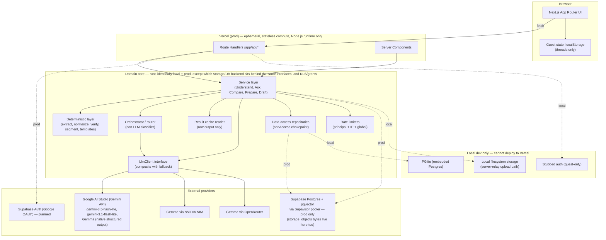
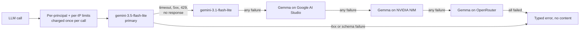
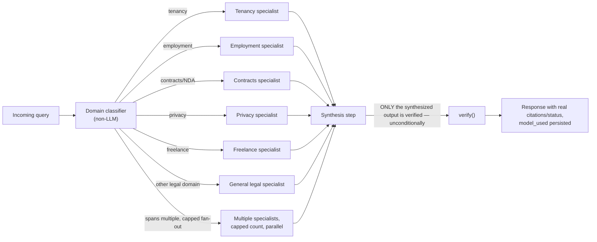
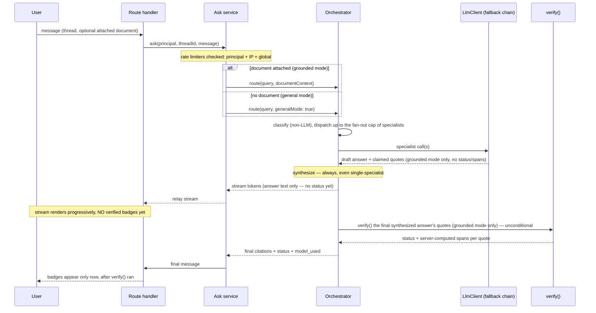

# Architecture

The system behind [PRODUCT.md](PRODUCT.md)'s five pillars: domain core, data layer, LLM layer,
multi-agent orchestrator and HTTP API. The code is the final authority; this document explains it.

## The One Guarantee

> **A finding, quote, or answer is never displayed as `verified` unless `verify()` has, at that
> moment, confirmed the exact text exists in the canonical source document, against the same text
> the UI displays. There is no code path — model response, cache, fallback model, degraded mode,
> orchestrator synthesis, guest-import, or error recovery — that sets `status: "verified"` without
> passing through `verify()`. If any change makes a `verified` badge appear without that check
> having run against the live canonical text, it is wrong regardless of what else it improves.**

Falsifiable two ways, not one: (a) delete the call to `verify()` on any path and a positive test
must fail; (b) a stub `verify()` that always returns `not_found` must also fail its own positive
tests ("a quote known to exist in the document returns `verified`") — a verifier that never really
verifies anything can't pass either. `verify()`'s own module returns a **branded `VerifyResult`
type** that only its implementation can construct; every repository write path that persists a
status accepts only that type, never a bare string — a structural backstop, not just a prose rule.

**Channels this holds across:**

| # | Channel | What the guarantee requires |
|---|---|---|
| 1 | **Model response payload** | The LLM's response schema has **no `status`/`verified` field, and no `quote_span_start`/`quote_span_end` fields** — the model cannot self-certify either its correctness or its location in the text. |
| 2 | **Streaming (chat)** | A streamed answer never renders a verified badge on a quote before the stream completes and `verify()` has run against the final text. Badges appear after, never optimistically. |
| 3 | **Orchestrator** | Specialist agents cannot emit a status. Only the final synthesized answer — after all specialists return, including the single-specialist case — passes through `verify()`, unconditionally, once. |
| 4 | **Model fallback (Gemini → Gemma)** | A composite `FallbackLlmClient` runs the same `verify()` path regardless of which tier produced the text. `model_used` is always surfaced **and persisted**, not just returned to the client, so a degraded response is never visually identical to the primary one, even after a reload. |
| 5 | **Errors / timeouts / rate limits** | No failure path returns a 200 with content, a cached-as-fresh response, or any status other than `not_found`/an explicit typed error. The boundary between "fall back" and "fail with an explicit error" is exact — see [Fallback and error boundary](#fallback-and-error-boundary). |
| 6 | **Cache** (`analyzed_result_cache`) | The cache stores the model's **raw, pre-verification output only** — never a status. Every read re-runs `verify()` against the *current* `canonical_text` before returning anything. The cache is never a source of trusted status, only a way to skip the LLM call. |
| 7 | **General-mode chat and Drafts** | No `verified` badge at all — there's nothing to verify against. Drafts carry a per-section "templated" vs "AI-generated" provenance label instead; general-mode answers carry a "general information, not verified against a document" label. Never reuse the verified-badge visual language for either. |
| 8 | **Span / display binding** | Quote spans are computed **server-side by `verify()` against `canonical_text`**, never accepted from the model. The UI always renders `canonical_text.slice(spanStart, spanEnd)` for a highlighted passage, never a model-supplied quote string. |
| 9 | **Persistence / guest-import** | Stored `verification_status` (on `findings`, `message_citations`, `comparison_changes`) is an **audit field only** — nothing reads it and trusts it directly. Every render re-verifies against live `canonical_text`. On guest→account import specifically, the server **discards any client-supplied status/citation fields** and re-runs `verify()` before persisting — a devtools-forged "verified" badge cannot survive import. |
| 10 | **Native-document mode** | `input_mode = 'native_document'` rows can **never** reach `verified` — `BEFORE INSERT OR UPDATE` database triggers and `verify()` itself both cap them at `approximate`/`not_found`. `canonical_text` for these rows is a model-produced transcription, labeled as non-independent evidence, not treated as ground truth. |

Channel names must match [`one-guarantee-channels.json`](../tests/architecture/one-guarantee-channels.json)
exactly — renaming a channel here means updating the registry in the same change.

Required regression coverage, checked by
[`one-guarantee-coverage.ts`](../tests/architecture/one-guarantee-coverage.ts) against that same
registry: one positive test ("the legitimate path produces the trusted outcome") and one negative
test ("the forged/failure path never produces `verified`") per channel, in a file the
`npm test -- verify` filter collects — not one broad test covering the whole guarantee, since a
single test can pass while an individual channel silently leaks.

---

## System context



### Deployment view — what actually runs where

| Component | Local impl | Prod impl | Runs on Vercel? | Identical call sequence? |
|---|---|---|---|---|
| Database | PGlite (embedded, `pg-core` dialect) | Supabase Postgres + pgvector, via the **Supavisor transaction pooler (port 6543)** | No (PGlite) — local only by construction | Yes — same Drizzle schema/queries |
| Storage | Local filesystem, server-relay (route handler → adapter → disk in one hop) | Postgres `storage_objects` (bytea), same server-relay shape (route handler → adapter → DB row in one hop) — forced whenever `VERCEL` is set, or via `STORAGE_BACKEND=postgres` off Vercel | Yes (Postgres backend; local FS is local-only by construction) | Yes — both adapters implement `StorageAdapter` (see [Storage adapter](#storage-adapter)) with the identical `server-relay` round trip; the Postgres adapter additionally caps uploads at 4 MB (`POSTGRES_MAX_UPLOAD_BYTES`) to stay under Vercel's request-body limit, tighter than the shared 15 MB cap, with the same `too_large` error shape either way. |
| Auth | Guest sessions, plus a dev-only sign-in for tests | Guest sessions (signed cookie); Supabase Auth with Google OAuth is planned | Guest path: yes | The domain logic gated on `principal.type === "user"` (save-to-project, claim) is exercised locally today, via a test harness that signs in a `UserPrincipal` directly rather than through a live session. What's **not** proven identical is the actual OAuth handshake and session-minting round trip itself — that only exists once the Supabase Auth adapter is written. |
| Data API / RLS grants | N/A — no Data API exists locally at all | **Deny-all**: no Data API grants issued for app tables | Yes, once the DB is Supabase | Effectively identical by construction — "no grants" locally (nothing to grant) and "no grants" in prod (deliberately withheld) are the same posture. |
| Rate limiting | Postgres counter tables against PGlite | Same tables, against Supabase Postgres | Yes, once the DB is Supabase | Yes — the atomic-upsert pattern is DB-engine-identical |
| LLM calls | Direct to the Gemini API, NVIDIA NIM and OpenRouter | Same | Yes | Yes |
| Domain core (services, deterministic layer, orchestrator, repositories) | Runs identically | Runs identically | Yes | Yes — no local/prod branching beyond the two exceptions named above |

**Production today.** The Supabase database is live: every numbered migration and the prod-only
files are applied, and the Data API denial check passes against it. The app deploys to Vercel with
the Postgres storage adapter, which Vercel forces. Production sign-in is guest-only by design: a
signed guest session, with guest data deleted after about three hours. A Supabase Auth adapter is
the planned extension; the `principal.type === "user"` paths it would feed are already exercised by
tests that sign in a `UserPrincipal` directly.

---

## Layer breakdown

### Client layer

Next.js App Router, two route groups: `src/app/(marketing)/` (the landing page at `/`,
`components/marketing/landing-page.tsx`) and `src/app/(app)/` (the signed-in/guest
product surface). Server Components for initial render, Client Components (`'use client'`) for
interactivity. Guest-mode state (the active thread list) lives in `localStorage` — **threads
only**; documents, comparisons and drafts are always DB rows, never client-only. Nothing
server-authoritative is trusted from client state: principal identity comes from an httpOnly signed
session cookie, never a client-supplied header.

No route that touches the DB or the LLM client opts into `runtime = "edge"`. App Router route
handlers already default to the Node.js runtime; a static check rejects any route file whose
`runtime` export is anything other than the literal `"nodejs"`, so a future route can't silently
opt into Edge, which can't hold a normal Postgres TCP connection.

**What's built so far.** `(app)/layout.tsx` mounts `AppShell` (`src/components/shell/app-shell.tsx`):
a collapsible sidebar, a skip link, an offline banner and the disclaimer footer. Root `providers.tsx`
mounts the theme provider, TanStack Query's client, the tooltip provider and the app's two standing
live regions (one polite, one assertive) plus the toaster once for the whole tree — `AppShell` and
every route below it must never mount a second copy of any of these, or the aria-live allow-list gate
sees nodes it doesn't expect. A dev/guest sign-in form and a settings screen exist; `src/lib/session/`
holds the cross-tab session sync (`BroadcastChannel("saboot:session")`, with the `storage` event as
the fallback), so a sign-in, sign-out, claim or delete-all in one tab clears every other open tab's
query cache and re-fetches `GET /api/session`. Every product screen — chat, the document workspace
(`/documents/:id`), compare, prepare, drafts and library — is built and reachable. The marketing
landing page itself has not been started.

**Channel 8 (span/display binding) has a client-side half.** The guarantee's server half is
`verify()` computing spans against `canonical_text`; the client's job is to never render a highlight
that binding doesn't back. `bindSpan()` (`src/lib/verification/bindSpan.ts`) is the one shared,
unit-tested function that does this — the **only** place in the app a span is bound to text: given a
`VerificationOutput`, the target document's `{ documentId, text, textHash }` (from `GET
/api/documents/:id/text`) and the citation's own expected `{ documentId }`, it returns a bound range
only when `expected.documentId` matches `target.documentId`, `verification.textHash ===
target.textHash`, and `target.text.slice(spanStart, spanEnd) === spanText` — otherwise `null`, and
nothing renders. `verify()` sets `textHash` on every `VerificationOutput` it produces (real document
hash, or the fixed `sha256("")` sentinel when there's no real document to bind against — see
[Document text endpoint](#document-text-endpoint) below), so a stale reload, a wrong-document pairing
or a doctored span all fail this check instead of rendering a false highlight. `VerificationBadge`
(`src/components/verification/verification-badge.tsx`) is the **only** renderer of a verified mark
anywhere in `src/app`, `src/components` and `src/lib` — enforced by a static repo-wide scan
([`verified-badge-single-source.ts`](../tests/architecture/verified-badge-single-source.ts)) for a
second, unaudited renderer of the label, icon or CSS token. The interactive "test this quote"
verifier a reader can run against their own document
(`src/components/workspace/verifier/verifier-demo.tsx`) renders through this same badge — an icon
plus the server-derived status, never text a model's output could imitate, so the badge can't be
forged by prompt injection even in the one component that lets a reader type arbitrary text.

### Route handlers

`src/app/api/**/route.ts`.

Thin adapters only, built with `route()` from [`handler.ts`](../src/server/http/handler.ts): parse
and validate the request against a zod contract, resolve the principal, call **exactly one**
service-layer function, map the result through its response contract. No domain logic lives here —
a static check in [`route-conventions.ts`](../tests/architecture/route-conventions.ts) enforces the
shape.

**Every principal-scoped fetch returns 404, never 403/401-with-detail**, for a resource that exists
but belongs to another principal — a 403 confirms existence. This holds for every entity fetch from
day one: `GET /documents/:id`, `/drafts/:id`, `/threads/:id`, `/comparisons/:id`, and the same
`canAccess` chokepoint the data layer uses.

**Cross-site gate.** Before any cookie is read or a guest session is minted, `route()` refuses a
state-changing request (`POST`/`PUT`/`PATCH`/`DELETE`) whose `Sec-Fetch-Site` header reads
`cross-site` or `same-site`, or — for a browser too old to send that header — whose `Origin` host
doesn't match the request's own host (`X-Forwarded-Host` behind a proxy, else `Host`). `Sec-Fetch-Site`
is set by the browser and can't be forged by a page. `same-site` is refused too: this app is one
origin with no CORS, so no legitimate caller is ever same-site, while a page on a sibling subdomain
still carries the app's `SameSite=Lax` cookies. Refusing before minting a cookie matters because a
cross-site form POST is otherwise cookie-less and would get a fresh guest cookie the browser stores
over the victim's, orphaning their rows.

**Security headers**, applied both by `next.config.ts` (every path — pages, 404s, static files) and
by `route()` on each API response: `x-content-type-options: nosniff`, `x-frame-options: DENY`,
`cross-origin-opener-policy: same-origin`, `referrer-policy: no-referrer`, `permissions-policy`
(camera/microphone/geolocation/payment/usb all denied), and in production only
`strict-transport-security: max-age=63072000; includeSubDomains` (no `preload` — that's a
custom-domain decision, and it would be a lie over the plain HTTP a local `next start` serves). The
`content-security-policy` restricts `default-src`, `object-src`, `base-uri`, `form-action`,
`frame-ancestors`, `img-src`, `font-src` and `connect-src` to `'self'` (plus `data:`/`blob:` for
`img-src`); `script-src`/`style-src` allow `'unsafe-inline'` — the App Router's own hydration script
carries no nonce yet — and `script-src` adds `'unsafe-eval'` under `next dev` only, for React Fast
Refresh. Whoever adds per-request nonces must extend this header, not replace it.

### Service layer (`src/server/services/{understand,ask,compare,prepare,draft}.ts`)

One module per feature surface. Each `analyze()`-shaped call:

1. Checks `analyzed_result_cache` for a matching raw output first.
2. On a miss: calls the deterministic layer to prepare input, calls the LLM (directly, or via the
   orchestrator for Ask), caches the raw output.
3. **Always**, cache hit or miss: runs the result through `verify()` fresh against the current
   `canonical_text`, persists the *audit* status via a repository, returns a typed result.
4. **Atomicity.** `analyze()` fails the whole request on any internal error — no partial
   persistence (findings 1–2 saved while 3–10 are silently dropped mid-batch is disallowed).
   **Idempotency.** The `analyses` table (one row per run: `document_id`, `prompt_version`,
   `model_used`, `created_at`) carries `UNIQUE(document_id, prompt_version, model_used)` — not keyed
   on `verifier_version`, since verification re-runs fresh on every read and isn't a property of the
   analysis run itself. `findings` carries an `analysis_id` FK. This prevents duplicate concurrent
   calls (two tabs, a retry after a timeout) from producing duplicate findings or LLM spend.

**Active-row caps.** Every create checks the calling principal's count of active (unexpired) rows
in `documents`, `comparisons` and `drafts` — every row, revisions included — against a default cap
(30 for a guest, 500 for a user; overridable via `MAX_ACTIVE_ROWS_PER_GUEST`/`_USER`), throwing
`RATE_LIMITED` over the cap. Inside the create transaction, a transaction-scoped advisory lock on
`(table, principal)` — held until commit — serializes concurrent creates for one principal, so they
count and insert one at a time and can never overshoot the cap.

**Prepare's reader lens.** `prepare.generate` takes a `?lens=` query parameter (role × stage, e.g.
`tenant_already_signed`) and writes its output — lawyer questions, a checklist, a Markdown export —
for that one perspective, echoing it back as `lens: { id, role, stage }`. An unrecognized lens for
the document's type is a 400; the default is the document type's first lens, the same default
Understand uses for a finding's own `explanation`.

### Samples (`src/server/samples/`)

Five bundled, pre-analysed Understand documents (`lease`, `offer_letter`, `nda`, `privacy_policy`,
`freelance`) a visitor can open with zero model calls and zero quota spent. `registry.ts` maps each
fixed `sampleId` to its bundled file bytes, the sha256 of the extracted canonical text it was recorded
against, a reshaped recording of a real `gemini-2.5-flash` capture, and the exact prompt
version/fingerprint the recording answers — a stale bundle, a divergent live prompt, or an edited
recording all refuse to replay rather than silently drifting from what was actually recorded. The
Compare sample (`lease_v2`) is deferred and deliberately absent from the registry; any unknown or
deferred sample id is a 404.

`POST /api/samples/:sampleId/open` runs the sample's bytes through the real `extractDocument()`
exactly like an upload, asserts the resulting hash matches the registry's pin, then runs the real
Understand service with `RecordedLlmClient` standing in for the LLM: it fingerprints its exact
expected prompt and throws on any mismatch, refuses a native-file input outright, and refuses to
stream (samples never stream) — so it can only ever answer the one call it was built for, never a
live oracle. `RecordedLlmClient` is imported nowhere but `src/server/samples/**` — never
`providers.ts`, the container, or the fallback chain — checked by a static import-graph test. The
replay still goes through `verify()`, still gets an audit row and still re-verifies on every read,
exactly like a live analysis; the only thing that never happens is a network call. Opening a sample
skips the `analyzed_result_cache` write specifically (never the persistence or re-verify steps), and
is idempotent per principal via the same advisory-lock pattern every create path uses. Sample replay
counts as channel 1 (model response) and channel 6 (cache) coverage, not an eleventh channel.

A sample document is otherwise an ordinary, owner-checked `documents` row (`sample_id` set, `IdParams`
guid), with one behavioural difference: `POST /api/documents/:id/analyze` on it refuses with
`sample_readonly` rather than ever turning a recorded analysis into a live one still labelled
"recorded" — checked *before* the ordinary idempotent-retry short-circuit would otherwise return the
sample's own recorded analysis as an unremarkable `200`.

### Document text endpoint

`GET /api/documents/:id/text` is the **one** route allowed to put canonical text on the wire — every
other response contract is kept clear of it by the wire-contract lint. It exists because the
analysis workspace and Compare need to render `canonical_text.slice(spanStart, spanEnd)` (channel
8's own requirement) and no endpoint returned a document's text before this one. It answers
`{ documentId, text, textHash, inputMode, sampleId }`; `text` is `canonical_text` verbatim, never run
through the model-text sanitizer that scrubs every other model-authored field — sanitizing it would
break `bindSpan()`'s exact-slice check even for a `native_document` transcription, which is
model-authored but is the canonical text of record. The response is `Cache-Control: no-store` with
no `ETag` and no `304` at all, so there's no conditional-GET path that could short-circuit around
`canAccess`. A document that hasn't finished extraction answers `422`/`document_not_ready` instead of
a 200 standing in with an empty string.

`toVerificationOutput()` (the one chokepoint every route uses to put a verification on the wire) sets
`textHash` on `verified`, `approximate` and `not_found` alike: the real `canonical_text_hash` when a
real document backs the verification, or a fixed anti-oracle sentinel, `sha256("")` =
`e3b0c44298fc1c149afbf4c8996fb92427ae41e4649b934ca495991b7852b855`, when there is no real document at
all (an unlinked citation, a foreign or deleted source). Without a fixed sentinel, a distinguishable
"no document" value would let `POST /api/verify-batch` or a citation's `textHash` be probed as a "does
document X contain string Y" oracle for documents the caller doesn't own; with it, every "nothing to
bind against" case is indistinguishable from every other one.

### Deterministic layer (`src/server/deterministic/`) — model-independent, property-tested

- **`extract/`** — server-side only, run against the uploaded file's bytes via its storage
  reference, never a client-submitted string. Produces `canonical_text`, `canonical_text_hash` and
  `extractor_version`, extracted in exactly one place and reused for prompting, verification and
  display.
  - **Format routing is by magic bytes, never the declared MIME type alone**: a `PK\x03\x04` header
    means a DOCX's zip container, `%PDF-` within the first 1 KiB means a PDF (readers accept the
    header anywhere in that window; some producers prepend bytes), anything else must decode as
    UTF-8. A mismatch between the declared type and the sniffed one is `INVALID_DOCUMENT`.
  - **The PDF/DOCX parse itself runs in a Node `worker_thread`**
    ([`sandbox.ts`](../src/server/deterministic/extract/sandbox.ts)), at most two at once per
    process (further calls wait for a free slot), under a resource-limited budget: a
    `startupTimeoutMs` (15 s) from spawn to the worker reporting ready — a slow start is never
    charged to the document — then a `deadlineMs` (20 s) for the parse itself, a V8 heap cap via
    `resourceLimits` (512 MB old generation, 32 MB young, 4 MB stack), and a polled external-memory
    cap (128 MB) for `pdf.js`'s own decode buffers, which V8's heap limits don't count. A breach
    terminates the worker; the calling thread only ever waits, so a hostile file can exhaust the
    worker's budget, never the request-serving thread.
  - **Normalization strips bidi control characters** (`normalize.ts`) — embeddings, overrides,
    isolates and directional marks (U+202A–202E, U+2066–2069, U+200E/200F, U+061C) — because each
    can reorder the characters around it on render, so a UI could display something other than the
    text `verify()` matched against (an override could turn a verified "03" into a displayed "30").
    Normalization also unifies line endings, strips stray control characters, applies Unicode NFC
    (guarded by a combining-mark-run cap, since NFC is near-quadratic on one long run), and
    collapses horizontal whitespace — idempotent by construction.
  - For `native_document`-mode input (a PDF whose pages mostly have no usable text layer — a scan or
    image), the document goes to the model's multimodal input instead, and the model's transcription
    becomes `canonical_text`, explicitly labeled as such: not independent evidence, hence the
    `verified`-ceiling database trigger (One Guarantee, channel 10).
- **`detect-type.ts`** — deterministic, keyword-based document-type detection, no LLM and no
  embeddings, reading the [document-type registry](../src/server/deterministic/document-type-registry.ts).
  Phrases that share a **concept** (alternate phrasings of the same idea, e.g. "licensor"/"landlord")
  are scored once, by whichever phrasing matched with the highest weight, so a document that
  consistently uses one phrasing per concept isn't penalized against a signature's unused synonyms.
  A type's confidence is its matched concept weight over its maximum possible weight; below a fixed
  threshold, detection falls back to `generic` rather than committing to a wrong type. The Draft
  service and prompt generation read the same registry, never a parallel hand-maintained list.
- **`segment.ts`** — clause segmentation, required by Compare's clause-alignment and Understand's
  per-clause findings.
- **`verify/`** — the matcher. Returns a branded `VerifyResult` (see [The One
  Guarantee](#the-one-guarantee)). Takes the source document's `input_mode` as a required parameter
  and caps its own return value at `approximate`/`not_found` whenever
  `input_mode = 'native_document'` — this cap lives inside `verify()` itself, not only as a
  persistence-time DB constraint, so it holds on every render, not only on write. The same cap
  applies wherever `verify()` is called — `findings`, `message_citations` and `comparison_changes`
  alike, since all three call the same shared implementation.
  Complexity is bounded, not an unbounded nested loop: exact matching is KMP, O(n+m)
  (`verify/exact.ts`). The `approximate`-path fuzzy matcher (`verify/approximate.ts`) tokenizes
  quote and document into words, then runs a linear sliding-window token-overlap count to find at
  most `MAX_CANDIDATE_WINDOWS` (8) candidate regions — a lossless prefilter for the edit-distance
  threshold, not a similarity score — before a bounded dynamic-programming edit-distance alignment
  runs over just those candidates. Vercel's Fluid Compute runs multiple concurrent request
  invocations on one instance, so an unbounded matcher would block *other users'* requests, not just
  its own. Property-tested (`fast-check`) specifically for worst-case timing on adversarial inputs
  (long documents, many near-miss quotes), not just correctness.
- **`draft-templates/`** — skeleton structures for every draftable document type, including the
  grounded-response category. Each section carries **guidance**: a short instruction that shapes
  the model's prompt for that one section (voice, what must be stated, "no commentary"), distinct
  from the section's stored `provenance` (`templated` vs `ai_generated`) — guidance drives
  generation, `provenance` records the result.

### LLM provider layer (`src/server/llm/`)

```typescript
// Provider-neutral — no adapter's SDK types leak past this boundary.
interface LlmClient {
  readonly capabilities: {
    structuredOutput: true; // required of every adapter
    nativeDocumentInput: boolean; // checked at the call site, not assumed
    streaming: boolean;
  };
  complete(input: {
    systemPrompt: string;
    userPrompt: string;
    schema: ZodSchema; // each adapter translates to its own dialect internally
    documents?: { canonicalText?: string; nativeFile?: { bytes: Uint8Array; mimeType: string } }[];
  }): Promise<{ data: unknown; modelUsed: string; tokensUsed: { input: number; output: number } }>;
  stream(input: { /* same shape as complete */ }): AsyncIterable<{ type: "token" | "done" | "error"; ... }>;
}

// Composite pattern: an ordered chain of tiers, the first the primary, the rest tried in order.
class FallbackLlmClient implements LlmClient {
  constructor(primary: LlmClient | LlmTier, ...fallbacks: (LlmClient | LlmTier)[]) {}
  // complete()/stream() return the answering tier's result unchanged — its own modelUsed, always
  // surfaced, always persisted downstream.
}
interface LlmTier { client: LlmClient; breaker?: CircuitBreaker; rateLimitKey?: string }
```

**Two adapters.** [`gemini.ts`](../src/server/llm/gemini.ts) speaks the Gemini API directly
(`@google/genai`, native structured output): it serves the primary, the second Gemini model, and
Gemma hosted on Google AI Studio (same key, its own per-model quota, no native-document input).
[`gemma.ts`](../src/server/llm/gemma.ts) is the OpenAI-compatible adapter, routed through NVIDIA
NIM and OpenRouter for the remaining two Gemma tiers — proof that `LlmClient` isn't secretly
Gemini-shaped.

**The provider chain** (`src/server/llm/providers.ts`), flattened by `createRateLimitedLlmClient`
into one chain under one deadline:



| # | Tier | Gateway | Native documents | Rate-limit bucket |
|---|---|---|---|---|
| 1 | `gemini-3.5-flash-lite` — primary; the analysis cache keys on it; sent no thinking budget | Google AI Studio | yes | `gemini` |
| 2 | `gemini-3.1-flash-lite` — its own per-model quota, sent no thinking budget | Google AI Studio | yes | `gemini_fallback` |
| 3 | Gemma on Google AI Studio — same key as tiers 1–2, its own per-model quota | Google AI Studio | no | `gemma_google` |
| 4 | Gemma via NVIDIA NIM | NVIDIA NIM | no | `gemma` |
| 5 | Gemma via OpenRouter (`:free` route) | OpenRouter | no | `gemma` |

Each tier charges its own bucket only when the chain actually calls it: a retry is charged again, a
tier skipped by its breaker is not. NIM and OpenRouter share the `gemma` bucket — unlike tiers 1–3
they don't share an account or quota with anything else, so there's nothing to conflate by keeping
them together. The caller — the principal and the client IP — is charged once per logical call,
outside the chain, never per tier and never per inbound HTTP request, since one Ask turn can fan out
into several LLM calls.

#### Fallback and error boundary

- **Retryable error on the primary** (timeout, 5xx, provider 429, no HTTP response at all, or its
  own global per-provider bucket already exhausted) → the fallback tiers are tried in order. Each
  tier is wrapped in its own global-limit check, so an exhausted primary bucket falls through
  exactly like a provider outage, before the primary's own client is ever called. Success: content
  is returned, the answering tier's `model_used`
  is surfaced and persisted, badges are computed normally via `verify()`.
- **Non-retryable error on the primary** (a 4xx, or a failed schema) → surfaces as is, no fallback:
  the request itself is wrong, and a backup answering it would hide that.
- **On a fallback tier**, the same errors move the chain on instead — one retired or incompatible
  backup must not stop the rest.
- **No HTTP response at all** gets one immediate retry on the same tier before falling through.
- **Budget.** The operation's `timeoutMs` bounds the whole chain. While a later tier could still
  answer, a tier may spend at most `TIER_BUDGET_SHARE` (0.75) of what's left; the last runnable tier
  gets the rest. No fallback tier or retry starts with under `MIN_FALLBACK_BUDGET_MS` (15 s) left.
- **Circuit breaker, per tier, in memory, per server instance.** Three consecutive provider failures
  (timeout, 5xx, provider 429, no response) open it, skipping the tier without a call for a window
  that starts at 60 s; then one trial call closes it (success) or re-opens it (failure), doubling the
  window each time it re-opens, capped at 10 minutes. A provider 429 that names a per-day quota opens
  the breaker immediately for the full 10-minute cap; a 429 that states a retry delay opens it
  immediately for that delay (clamped between the 60 s base and the 10-minute cap). A 4xx, a schema
  failure, our own rate limit, and a cancelled call never count as failures.
- **A native-document request** skips any tier that cannot read one; if none can, the primary's
  error surfaces.
- **Every tier fails, or a rate limit applies to every tier** → an explicit typed error
  (`RATE_LIMITED` / `UPSTREAM_UNAVAILABLE` / `TIMEOUT`), no content, no queueing past a bound shorter
  than the client's own timeout. The error that surfaces is the real cause: the primary's (or, for a
  tier skipped by its breaker, the error that opened it), unless a fallback tier failed for a reason
  that isn't itself a provider outage — our own `RATE_LIMITED`, or `SCHEMA_FAILED`.

#### Rate limiting

Three tiers, each an atomic `INSERT ... ON CONFLICT ... RETURNING` against its own table (see
[SCHEMA.md](SCHEMA.md#rate-limits-and-the-result-cache)), never read-then-write and never inside a
transaction that spans an LLM call:

- **Per IP, per request, every route** (default 60/min) — the universal backstop, charged even on
  routes with no LLM call.
- **Per principal and per IP, per LLM call**, both per minute (default 5/min each) and per UTC day
  (default 10/day per principal, 15/day per IP) — charged once per logical LLM call, at the
  `LlmClient` boundary, never per inbound HTTP request. The per-IP LLM tier exists because a guest
  principal is self-issued: a script that sheds its cookie gets a fresh principal bucket but keeps
  its IP bucket. Check order is principal/minute → IP/minute → principal/day → IP/day, so a call
  throttled for the minute never spends daily budget, and a principal over its own per-minute limit
  never charges the IP its neighbours share.
- **Global, per provider quota** (default per minute: `gemini` 7, `gemini_fallback` 7, `gemma` 10,
  `gemma_google` 7) — derived from assumed provider RPM ceilings divided by the at-most-two HTTP
  attempts one logical call can make (the original plus one schema-repair retry), so the worst case
  stays under quota even when every call retries.

The primary model's free tier allows 500 requests a day, and each fallback model has its own quota.
The daily caps (62 calls per principal, 124 per IP) keep one guest, or one IP cycling guest
cookies, from spending the day's quota alone. Every limit is
overridable by its own `RATE_LIMIT_*` environment variable, clamped to a sane ceiling so a
misconfigured value can misconfigure the limiter but never disable it or take the app down.

### Orchestrator (`src/server/orchestrator/`)

Multi-agent routing over a broad domain taxonomy, deeply tuned on five focus types. **The domain
classifier is non-LLM** (a cheap heuristic classifier), so it's never an uncounted addition to the
per-turn model budget. Document-type (the Understand/Draft axis) and orchestrator-domain (the
Ask/routing axis) are separate registries that happen to share five default values today, not the
same enum. **Fan-out is capped** at `MAX_SPECIALISTS` (2) specialists dispatched in parallel per
query, regardless of how many domains it nominally spans — both for cost and because each
additional specialist call carries a full document's worth of tokens (`orchestrator/config.ts`).

Only the final synthesized answer is verified: specialists never emit a status, and `verify()` runs
unconditionally downstream of synthesis on every path, including the single-specialist case.

**Context cap.** The orchestrator owns it, because it builds every prompt: conversation history is
bounded by a turn count and a character budget (oldest whole turns dropped first), and attached
documents share one per-call canonical-text budget — exceeding it is a typed `VALIDATION_FAILED`,
never a silent truncation, since a truncated document could make a grounded answer silently miss
content. The Ask service additionally loads only a bounded window of saved messages, and the route
contract caps a guest's client-held history before it reaches the service.



### Data-access layer (`src/server/data/`) — one `canAccess` chokepoint

```typescript
type Principal = { type: "user"; userId: string } | { type: "guest"; guestSessionId: string };

// The single authorization chokepoint. Pure and synchronous — no I/O, so it can't fail open on a
// DB error. isNonEmptyId treats a blank string the same as null, so a malformed resource (both
// owners unset, or both set) is never accidentally "accessible".
function canAccess(principal: Principal, resource: OwnedResource): boolean {
  const hasUserOwner = isNonEmptyId(resource.ownerUserId);
  const hasGuestOwner = isNonEmptyId(resource.ownerGuestSessionId);
  if (hasUserOwner === hasGuestOwner) return false; // exactly one owner column must be set
  if (hasUserOwner) {
    return principal.type === "user" && isNonEmptyId(principal.userId) && principal.userId === resource.ownerUserId;
  }
  return principal.type === "guest" && isNonEmptyId(principal.guestSessionId) && principal.guestSessionId === resource.ownerGuestSessionId;
}
// assertCanAccess(p, r) throws a 404-shaped error for a missing or non-owned resource;
// assertCanAccessAll(p, rs) is the multi-entity form every association (Compare, attach-to-
// thread/project) uses, and throws on an empty list too — zero resolved entities is itself a bug.
```

Every repository function requires a `principal` and calls `canAccess`, `assertCanAccess` or
`assertCanAccessAll` — no "get by ID" method exists without an ownership check. **Any function that
associates two or more entities verifies the principal owns every one of them**, not only the
primary one being written (Compare's document pair, attaching a document to a thread or project).

Backed by Drizzle ORM, `pg-core` dialect. The connection factory (see [Postgres connection
handling](#postgres-connection-handling)) is the only thing that differs by environment.

**Message ordering.** `listRecentMessages` orders by `created_at DESC, id DESC` — `id` is a UUIDv7
(monotonic), breaking exact-timestamp ties deterministically, then reverses the page for
chronological display. The same append-only, slice-from-the-end contract is required of the
client-side `localStorage` message array for unsaved guest threads, tested client-side too.

### Postgres connection handling

- **`DATABASE_URL` is pinned to the Supavisor transaction pooler (port 6543)**, never the direct
  connection (port 5432, IPv6-only by default — Vercel Functions don't support outbound IPv6, so the
  direct connection cannot connect from Vercel at all). The direct connection is reserved for
  migration tooling run outside Vercel's network.
- Connection factory: `postgres(url, { prepare: false, max: N })` — `prepare: false` is required
  because Supavisor's transaction-mode pooler doesn't support prepared statements. `N` is sized to
  expected in-instance concurrency, since Fluid Compute deliberately runs multiple concurrent
  invocations per instance. Instantiated once at module scope, reused across invocations sharing an
  instance, never recreated per invocation.
- **A repository function never holds a connection or an open transaction across an LLM call.**
  Fetch and persist in short, separate transactions strictly before and after the round-trip, never
  spanning it — the single highest-leverage rule for not exhausting the pooler under concurrency.

### Storage adapter

`src/server/storage/`.

```typescript
interface StorageAdapter {
  // Mints a ref without the object existing server-side yet. Validates mimeType/sizeBytes against
  // the upload policy (allowlist + size cap) before any bytes move anywhere.
  createUploadTarget(principal: Principal, metadata: { filename: string; mimeType: string; sizeBytes: number }):
    Promise<{ method: "direct-put" | "server-relay"; uploadUrl?: string; ref: string }>;

  // Server-relay write step; only called when createUploadTarget returned "server-relay".
  writeRelayed(principal: Principal, ref: string, bytes: Uint8Array): Promise<void>;

  // Verifies the object exists and that `ref`'s owner-prefix matches the calling principal — the
  // one place the ref's own prefix is itself an authorization input. Returns what
  // createUploadTarget was told, so the caller's later request can never substitute a different
  // filename or type: the record made at upload time is what a document takes.
  confirmUpload(principal: Principal, ref: string): Promise<{ filename: string; mimeType: string }>;

  readObject(ref: string): Promise<Buffer>; // server-internal only, not principal-scoped

  // Authorizes via canAccess against the DB row's *current* owner columns, never by re-parsing the
  // ref's own prefix.
  getSignedUrl(principal: Principal, row: { storageRef: string; ownerUserId: string | null; ownerGuestSessionId: string | null }): Promise<string>;
  delete(principal: Principal, row: { storageRef: string; ownerUserId: string | null; ownerGuestSessionId: string | null }): Promise<void>;
}
```

`storage_ref` is namespaced `{principalKey}/{uuid}/{filename}` — the owner-prefix is checked by
`confirmUpload` **once, at creation time**, to prove the upload was legitimately minted for the
calling principal. It is not re-parsed on every later access: `getSignedUrl`/`delete` authorize
against the owning row's *current* owner instead, via `canAccess`. This is what makes guest→account
claim work correctly — claiming a document updates the DB row's owner columns, and access checks
immediately follow that updated ownership, with no need to rename or move the underlying storage
object, whose path keeps its original `guest:<sessionId>` prefix forever (a historical artifact of
the ref's name, not a live authorization input).

Guest uploads carry `expires_at` (3 hours). Deletion runs through
[`prod-only/0007_guest_ttl_sweep_postgres_storage.sql`](../src/db/migrations/prod-only/0007_guest_ttl_sweep_postgres_storage.sql):
a `pg_cron` job, every 5 minutes, that deletes expired guest rows and their `storage_objects` bytes
in the *same* transaction — no `pg_net`, no Edge Function, no Vault secret, since the bytes are
already rows in this database once the Postgres storage backend is active (the path Vercel always
forces — see the deployment view above). The same sweep also clears any `storage_objects` row gone
unreferenced for over an hour (an abandoned upload, or a document deleted through the cleanup
outbox below), so the outbox needs no separate worker on this backend. 0007 supersedes an earlier
migration ([`prod-only/0003_m4_pg_cron_pg_net_jobs.sql`](../src/db/migrations/prod-only/0003_m4_pg_cron_pg_net_jobs.sql))
designed around a real external object store reached through `pg_net` and a storage-cleanup Edge
Function that was never written — that path is skipped now that production storage lives in
Postgres. `npm run db:migrate:remote` applies the numbered migrations, then prod-only `0004`,
`0005`, `0006`, `0001`, `0002`, `0007`, in that order: the narrow revokes precede 0001 because
0001's post-condition asserts no public object is still reachable by the Data API roles.

A `StoragePurger` interface, `LocalFsStoragePurger` and `PostgresStoragePurger` implementations
exist (`storage/purger.ts`, `storage/postgres-purger.ts`) for whichever job ends up calling them,
but nothing in local dev schedules a sweep today — expired guest rows and their files are not yet
actually deleted locally. The intended delete ordering and the cascade rules it depends on are in
[SCHEMA.md](SCHEMA.md#delete-behaviour).

### Auth adapter (`src/server/auth/`)

Built today: a guest-only stub (`src/server/auth/session.ts`, `claim.ts`) — an httpOnly, HMAC-signed
session cookie, no real sign-in flow. **Not built yet:** a Supabase Auth adapter; the design intent,
noted in `session.ts`, is a `{ type: "user" }` principal built only from a verified Supabase Auth
claim (`getClaims()`, never `getSession()` server-side), never trusted from request data beyond a
cookie's verified signature. Both principal shapes are meant to flow through the same `canAccess`
chokepoint once that adapter exists — one authorization code path, not one for guests and a
different one for users.

---

## Key flows

### Understand (analysis) pipeline

Two route handlers, each calling exactly one thing — upload and analysis are separate concerns, not
one oversized handler:

```mermaid
sequenceDiagram
    participant U as User
    participant API as Route handler
    participant Store as StorageAdapter
    participant Svc as Understand service
    participant Cache as analyzed_result_cache
    participant Det as Deterministic layer
    participant LLM as LlmClient (fallback chain)
    participant Repo as Repository

    Note over U,Store: POST /api/uploads — one call
    U->>API: request an upload target
    API->>Store: createUploadTarget(principal, metadata)
    Store-->>U: signed PUT URL (prod) / relay target (local)
    U->>Store: PUT file bytes

    Note over U,Svc: POST /api/documents {ref} — the route handler calls exactly one service function
    U->>API: confirm upload, request analysis
    API->>Svc: analyze(principal, ref, metadata)
    Svc->>Store: confirmUpload(principal, ref) — validates owner-prefix, returns the declared filename/type
    Svc->>Repo: insert document row, processing_status: pending
    Svc->>Det: extract() — server-side, size-capped, reads bytes via ref
    alt extraction succeeds
        Det-->>Svc: canonical_text, hash, extractor_version
        Svc->>Repo: update row: processing_status: ready, canonical_text/hash, jurisdiction/document_type
    else extraction fails (corrupt/unparseable)
        Det-->>Svc: extraction error
        Svc->>Repo: update row: processing_status: extraction_failed
        Svc-->>API: typed error, no further steps
    end
    Svc->>Cache: lookup(hash, type, jurisdiction, promptVersion, modelId) — not lens-keyed, one call covers every lens
    alt cache hit
        Cache-->>Svc: raw model output including every lens variant (no status)
    else cache miss
        Svc->>LLM: prompt (whole document; schema: findings + claimed quotes for every lens, no status/span fields)
        LLM-->>Svc: structured findings + finding_lens_explanations, modelUsed
        Svc->>Cache: store raw output
    end
    Svc->>Det: verify() each claimed quote — always, cache hit or miss, once per finding not per lens
    Det-->>Svc: VerifyResult per finding (status, server-computed spans)
    Svc->>Repo: insert analyses row (document_id, prompt_version, model_used) — the idempotency guard
    Svc->>Repo: persist findings as audit rows, linked via analysis_id
    Svc-->>API: result
    API-->>U: findings, each with a real, freshly-checked status
```

### Ask (chat) — streaming and verify

The route handler calls exactly one service function; the orchestrator is an internal collaborator
of the Ask service, never called directly from the route handler:



### Guest document lifecycle

```mermaid
sequenceDiagram
    participant G as Guest browser
    participant API as Route handler
    participant Store as StorageAdapter
    participant Repo as documents/comparisons/drafts repos
    participant Cron as pg_cron (Supabase-native)

    G->>API: createUploadTarget request (guest session cookie)
    API->>Store: createUploadTarget(principal, metadata)
    Store-->>G: signed PUT URL (prod) — direct browser-to-Storage
    G->>Store: PUT file bytes (direct, bypasses the function body size limit)
    G->>API: confirm
    API->>Store: confirmUpload(principal, ref) — validates owner-prefix
    API->>Repo: insert row (owner = guestSessionId, expires_at = now + 3h)
    loop pg_cron, independent of Vercel's own cron cadence
        Cron->>Repo: find expired guest rows (documents, comparisons, drafts)
        Cron->>Repo: re-check expires_at < now() at delete time
        Cron->>Store: delete via the Storage API (never a raw row delete)
        Cron->>Repo: delete row (cascade per SCHEMA.md's delete semantics)
    end
    alt guest signs in before expiry
        G->>API: sign in (Google OAuth)
        API->>Repo: transaction: re-check expires_at, then re-own documents/comparisons/drafts to the new userId
        API->>Repo: client pushes its localStorage thread/message array — server discards any client-supplied status/citation fields, re-runs verify(), creates new owner_user_id-scoped thread rows
    else guest never signs in
        Note over Cron: rows deleted at TTL, once the cron pipeline is wired up. Today, nothing in local dev deletes expired rows or bytes; a guest row simply outlives its own expires_at until the design above is deployed
    end
```

**Reopening an unsaved guest thread from `localStorage` also re-verifies.** A guest thread held
client-side can be closed and reopened (browser restart, tab reload) without ever touching the
server in between. Channel 9's "every render re-verifies" promise still applies: on reopen, the
client sends the thread's claimed quotes and source document ids to `POST /api/verify-batch`, which
re-runs `verify()` against the *current* server-held `canonical_text` for each referenced document
and returns fresh statuses — the locally cached status from when the thread was first generated is
never rendered directly. A referenced document that has since expired returns `not_found` for its
citations, same as any other case where the quote can no longer be checked.

**`verify-batch` is principal-scoped like every other endpoint, not an open content oracle.** Every
`documentId` in the batch is checked with `canAccess(principal, document)` before its quotes are
checked; a document the calling principal doesn't (or no longer, post-expiry) own returns
`not_found` for every quote against it — identical to the "quote doesn't exist" case, never a
distinguishable error that would let the endpoint be probed as a "does document X contain string Y"
oracle for documents the caller doesn't own. The endpoint also caps batch size and per-quote length,
and sits behind the same three-tier rate limiting as every other route.

---

## Security model

- **Authorization.** The `canAccess` chokepoint, principal-scoped; every multi-entity association
  checks ownership of every referenced entity.
- **Second layer: deny-all Data API posture.** App tables never receive PostgREST grants for
  `anon`/`authenticated` roles. The prod-only revoke migration is tested against stand-in roles on
  PGlite; against the live project, `npm run db:migrate:remote` queries
  `information_schema.role_table_grants` after applying and fails if either role still holds any
  privilege on a public table.
- **Guest identity.** An httpOnly, signed session cookie — never a client-supplied header. A
  CSPRNG-generated session id, `timingSafeEqual`-compared against its signature so a forged cookie
  can't be brute-forced by timing (`auth/session.ts`). Rotating `GUEST_SESSION_SECRET` invalidates
  sessions on a grace period: `GUEST_SESSION_SECRET_PREVIOUS` verifies against the previous secret
  during rotation, so live guest sessions survive it.
  - **Cross-site requests.** See [Route handlers](#route-handlers) for the `Sec-Fetch-Site` gate.
- **Signed local-storage URLs.** The same `timingSafeEqual` pattern signs and verifies the local
  filesystem adapter's relay URLs (`storage/signed-url.ts`) — the local stand-in for a real signed
  Storage PUT/GET URL, expiring and HMAC-signed. Applies today's standing rule (a wrong or expired
  signature is a 404, not a 403) to storage access, not only to route handlers.
- **Rate limiting.** See [Rate limiting](#rate-limiting). The per-request IP tier also prunes rows
  untouched for 2 days, at most every 10 minutes per process — the only pruning a local database
  gets; a prod-only migration schedules the same prune via `pg_cron` every 5 minutes, with the same
  2-day retention, which must outlive the daily window or a prune would reset a daily count.
- **Client IP.** `clientIpFromHeaders` is the only reader. On Vercel (`VERCEL` set) it trusts only
  `x-vercel-forwarded-for`, which the platform sets. Anywhere else it trusts `x-forwarded-for` only
  when `TRUSTED_PROXY_HOPS` says how many reverse proxies front the app, taking the entry that many
  places from the right. Otherwise every request is one shared `UNKNOWN_CLIENT_IP` bucket: safe, but
  a self-hosted deploy behind a proxy must set `TRUSTED_PROXY_HOPS` or every client shares one
  rate-limit bucket. IPv6 is grouped by `/64`.
- **Secrets.** Provider keys (`GEMINI_API_KEY`, `NVIDIA_API_KEY`, `OPENROUTER_API_KEY`) are
  server-only, never referenced in client code.
- **Injection / off-topic input.** The LLM response schema having no `status` field is itself the
  primary injection mitigation: a successful prompt injection still can't make the model emit a
  trusted verified claim. The non-LLM domain classifier routes anything with a plausible legal angle
  to the general legal specialist rather than refusing it. Input with no legal angle at all gets a
  polite, explicit redirect — never silently answered as legal content, and never silently dropped
  either.
- **Uploads.** MIME allowlist (PDF, DOCX, plain text) plus byte, page and decompression caps,
  enforced both before storage (the declared type and size) and again at extraction (the actual
  bytes). Storage refs are owner-prefixed and parsed as hostile input. Document text is always
  extracted on the server from the stored bytes, never accepted as a client-submitted string.

---

## Env inventory

| Var | Scope | Notes |
|---|---|---|
| `GEMINI_API_KEY` | server-only | Also serves the second Gemini model and Google-hosted Gemma (see the provider chain) |
| `NVIDIA_API_KEY` | server-only | Gemma via NVIDIA NIM |
| `OPENROUTER_API_KEY` | server-only | Gemma via OpenRouter |
| `GEMINI_MODEL`, `GEMINI_FALLBACK_MODEL`, `GEMMA_MODEL_GOOGLE`, `GEMMA_MODEL`, `GEMMA_MODEL_NIM`, `GEMMA_MODEL_OPENROUTER` | server-only, optional | Model-id overrides; defaults in [`providers.ts`](../src/server/llm/providers.ts). `GEMMA_MODEL` is shared by NIM and OpenRouter only — Google's Gemma id is spelled differently |
| `DATABASE_URL` | server-only | Empty = local PGlite path; prod = the Supavisor pooler connection string, port 6543 — never the direct/5432 connection |
| `GUEST_SESSION_SECRET` | server-only | Signs the guest session cookie, ≥32 bytes |
| `GUEST_SESSION_SECRET_PREVIOUS` | server-only, optional | Verify-only previous secret during rotation, so live guest sessions survive |
| `RATE_LIMIT_IP_HASH_SECRET` | server-only | HMAC key for IP-bucket keys — raw IPs are never stored |
| `LOCAL_STORAGE_SIGNING_SECRET` | server-only | Signs `local-storage:` relay/signed URLs — read by whichever storage adapter is installed, local filesystem or Postgres |
| `STORAGE_BACKEND` | server-only, optional | `postgres` forces the Postgres/`bytea` storage adapter; `local` or unset picks the local filesystem adapter, except on Vercel (`VERCEL` set), where Postgres is forced regardless — each function instance has its own ephemeral disk |
| `RATE_LIMIT_{PRINCIPAL,IP,GEMINI,GEMINI_FALLBACK,GEMMA,GEMMA_GOOGLE}_PER_MINUTE` | server-only, optional | Per-minute limit overrides, one per bucket; defaults in [`limiter.ts`](../src/server/rate-limit/limiter.ts) |
| `RATE_LIMIT_IP_LLM_PER_MINUTE`, `RATE_LIMIT_PRINCIPAL_PER_DAY`, `RATE_LIMIT_IP_LLM_PER_DAY` | server-only, optional | Per-call IP limit and the daily LLM-call caps per principal and per IP |
| `MAX_ACTIVE_ROWS_PER_GUEST`, `MAX_ACTIVE_ROWS_PER_USER` | server-only, optional | Active-row cap overrides; defaults in [`documents.ts`](../src/server/data/documents.ts) |
| `TRUSTED_PROXY_HOPS` | server-only, optional, off Vercel only | Number of reverse proxies in front of the app; unset means `x-forwarded-for` is ignored and every client shares one bucket |
| `VERCEL` | set by the platform | When present, only `x-vercel-forwarded-for` is trusted for the client IP |

Every value may stay blank for local work; see [README.md](../README.md#run-it-locally) for what
works keyless.
