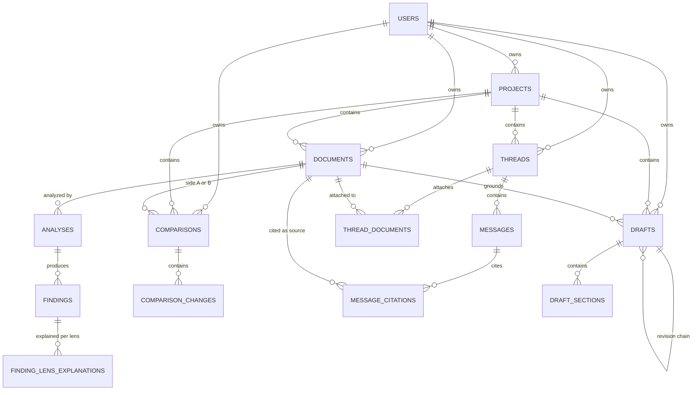

# Data model

The schema is plain Postgres, written against Drizzle's `pg-core` dialect. It runs unchanged on
PGlite locally and in tests, and on Supabase Postgres in production.

**The migrations are the contract.** They are hand-written SQL in
[`src/db/migrations/`](../src/db/migrations/). This document explains them; where the two
disagree, the SQL wins.

- The runner ([`migrate.ts`](../src/db/migrate.ts)) applies every top-level `NNNN_*.sql` file in
  order, each file in its own transaction. It checksums every applied file and refuses to run if
  one has changed, so a fix always goes forward in a new file.
- [`schema.ts`](../src/db/schema.ts) mirrors the SQL for typed queries. Drizzle Kit's diff is used
  only as a parity check, never as a generator.
- `migrations/prod-only/` needs Supabase roles and (for most of them) `pg_cron`, and is applied only
  there, by [`scripts/db-migrate-remote.ts`](../scripts/db-migrate-remote.ts) (`npm run
  db:migrate:remote`). It runs every numbered migration first, then the prod-only files in this
  order: `0004`, `0005`, `0006`, `0001`, `0002`, `0007`. The three narrow revokes go first because
  0001's post-condition checks that no public table or function is still reachable by the Data API
  roles, which holds on a fresh database only once objects added after 0001 are revoked too. 0003
  (superseded by 0007 below) also needs `pg_net` and is skipped. Applied prod-only files are
  checksummed in `schema_migrations_prod_only`, and an edited one is refused.
- `migrations/pending/` holds work blocked on a dependency. The runner applies neither folder.

## Access rules

- **No direct table access.** No route handler or service queries a table directly. Every
  repository function in [`src/server/data/`](../src/server/data/) takes `(db, principal, …)` and
  authorizes through one chokepoint, `canAccess(principal, resource)`, in
  [`access.ts`](../src/server/data/access.ts). The function is pure and synchronous.
- **One owner per row.** `documents`, `comparisons` and `drafts` carry an owner pair,
  `owner_user_id` and `owner_guest_session_id`. A CHECK requires exactly one of the two, and a guest
  owner id may not be blank.
- **User-only tables.** `projects` and `threads` have a NOT NULL `owner_user_id`. A guest never owns
  either.
- **Every entity is checked.** An operation that links entities checks the principal owns every one
  of them: both documents of a comparison, a draft's grounding document, and the project and item in
  save-to-project.
- **Foreign rows are 404.** A foreign, missing or malformed id returns 404 `NOT_FOUND`, never 403.
- **No Data API access.** App tables receive no Data API grants. The prod-only migration
  [`0001_m3_revoke_data_api_grants.sql`](../src/db/migrations/prod-only/0001_m3_revoke_data_api_grants.sql)
  revokes all privileges from `PUBLIC`, `anon` and `authenticated` on every app table and function,
  then asserts that none survive. Row-level security is not used, because `auth.uid()` does not
  exist on PGlite. The revoke is tested against stand-in roles on PGlite. Against the live project,
  `npm run db:migrate:remote` queries `information_schema.role_table_grants` after applying and
  fails if `anon` or `authenticated` still holds any privilege on a public table.

## Entity relationships



Guests own documents, comparisons and drafts through `owner_guest_session_id`, which is not a
foreign key. Guest chat threads are held by the client and never become rows until a signed-in
user saves them.

## Enums

| Type | Values |
|---|---|
| `input_mode` | `text`, `native_document` (a scanned PDF, transcribed by the model) |
| `processing_status` | `pending`, `ready`, `extraction_failed` |
| `verification_status` | `verified`, `approximate`, `not_found` |
| `finding_category` | `obligation`, `deadline`, `penalty`, `ambiguity`, `missing_clause` (no severity, by design) |
| `comparison_change_type` | `added`, `removed`, `changed` |
| `message_role` / `message_mode` | `user`, `assistant` / `grounded`, `general` |
| `draft_mode` | `from_scratch`, `document_grounded` |

## Tables

### `users`, `projects`

- **`users`.** The id is the auth provider's user id and is never minted here. The table holds no
  credential columns.
- **`projects`.** Owned by one user.
  - `opened_at` orders the sidebar list.
  - `color` and `icon` are free text for now.

### `documents`

One row per uploaded document. `canonical_text`, `canonical_text_hash` and `extractor_version` hold
the single server-side extraction that prompting, verification and display all reuse. A
client-supplied string is never accepted as canonical text.

- **`input_mode`.** NULL while the document is `pending`, and immutable once set (enforced by a
  trigger).
- **Ready means extracted.** A CHECK requires `processing_status = 'ready'` to imply that the input
  mode, text, hash and extractor version are all present.
- **`document_type`.** A CHECK lists every id in the
  [document-type registry](../src/server/deterministic/document-type-registry.ts), and a test fails
  if the two diverge.
- **`jurisdiction`.** An ISO country code, `IN` by default.
- **`storage_ref`.** Unique, and case-insensitively unique too, so one stored object backs at most
  one row. It is namespaced `{principalKey}/{uuid}/{filename}` and keeps its original guest prefix
  after a claim. Access always follows the row's current owner, never the ref's name.
- **`expires_at`.** Required for guest rows: upload time plus 3 hours.
- **`title`.** Nullable; an untitled row resolves to its `filename` at the service layer, never here.
- **`sample_id`.** Nullable; names which bundled sample (`src/server/samples/registry.ts`) a document
  was opened from, if any. Validated against the live registry in the service, not a DB CHECK — the
  sample set is expected to grow, so a registry-mirrored CHECK would need a new migration every time
  it does.
- **`updated_at`.** Bumped by every write that changes what the row shows (rename, analysis
  complete, save-to-project, unassign) in the same statement — never by a trigger, since a guest→user
  claim rewrites owner columns without that being a visible change worth reordering the library by.

### `analyses`, `findings`, `finding_lens_explanations`

- **`analyses`.** One row per analysis run. `UNIQUE (document_id, prompt_version, model_used)`
  makes concurrent or retried analysis idempotent.
- **`findings`.** Each finding belongs to one analysis. A composite FK pins
  `(analysis_id, document_id)` to that analysis's own document.
- **Status columns.** `verification_status`, the quote spans and `verifier_version` are **audit
  fields**. Every read re-verifies against the live canonical text and returns only that result
  ([ADR 0003](adr/0003-reverify-on-every-read.md)).
- **CHECKs on findings:**
  - a status exists if and only if a quote exists, so a `missing_clause` finding has neither;
  - a status requires a verifier version;
  - spans are both set or both NULL, ordered and non-negative;
  - `verified` requires a span.
- **`model_used`.** NOT NULL on analyses and findings.
- **Lenses.** `finding_lens_explanations` holds one row per `(finding, lens)`. It is the same
  finding framed for a different reader. Quote, status and spans never vary by lens, so this table
  has no status.

### `comparisons`, `comparison_changes`

- **`comparisons`.** Owned like documents, with `model_used` NOT NULL.
  - The document pair is immutable (enforced by a trigger).
  - A guest comparison's `expires_at` is capped at `LEAST(documentA.expires_at,
    documentB.expires_at)`.
  - `title` (nullable; resolves to `"<title A> vs <title B>"`) and `updated_at` (bumped the same way
    as `documents.updated_at`) follow the same pattern as documents.
- **`comparison_changes`.** Each side (`quote_text_a/b`, `doc_a/b_span_*`,
  `verification_status_a/b`) is verified independently against its own document, under the same
  CHECKs as findings. An added or removed change has no quote, and so no status, on its missing
  side.

### `threads`, `thread_documents`, `messages`, `message_citations`

- **`threads`.** Signed-in users only.
- **`thread_documents`.** Links a thread to the documents it is grounded in. Its primary key is
  `(thread_id, document_id)`.
- **`messages.id`.**
  - Supplied by the app as a **UUIDv7**, with no default.
  - A CHECK rejects any other version.
  - This makes `ORDER BY created_at DESC, id DESC` a deterministic "latest N" even when timestamps
    tie.
- **Other `messages` columns.**
  - `mode` is NULL exactly for user messages.
  - Assistant messages require `model_used`.
  - `routed_domain_array` records every specialist that answered.
- **`message_citations`.** Audit status and spans, like findings. `source_document_id` is
  `SET NULL` on delete, so a citation survives its document and re-verifies to `not_found`.

### `drafts`, `draft_sections`

- **`drafts`.** Owned like documents, with `model_used` NOT NULL and a `jurisdiction` ISO CHECK.
  - `grounding_document_id` may be set only in `document_grounded` mode.
  - `parent_draft_id` forms the revision chain.
  - A guest draft expires no later than its grounding document. Every revision takes its chain
    root's `expires_at`, `projectId` and `title` — a revision is always a continuation of its
    parent's identity, never a fresh, unfiled draft.
  - `title` (nullable; resolves to `"<type label> draft"`) is stored on **every row in the chain**,
    not derived from the root at read time, so a rename rewrites every revision in one transaction.
  - `user_instructions` (nullable) records what a revision was actually asked for. Rows written
    before this column existed have nothing to show and stay NULL — inventing a value for them
    would misattribute a request nobody made.
- **`draft_sections.provenance`.** Records where a section's text came from, `templated` or
  `ai_generated`. A CHECK rejects any value mentioning verification, because drafts are never
  verified.

### Rate limits and the result cache

- **The three bucket tables.** `rate_limit_buckets` (per principal), `ip_rate_limit_buckets` (HMAC
  of the client IP, never the raw address) and `global_llm_rate_limit` (per provider). Each has a
  primary key of `(key, window_key)`, and each is written only with an atomic upsert:

  ```sql
  INSERT INTO rate_limit_buckets (principal_key, window_key, request_count, updated_at)
  VALUES ($1, $2, 1, now())
  ON CONFLICT (principal_key, window_key)
  DO UPDATE SET request_count = rate_limit_buckets.request_count + 1, updated_at = now()
  RETURNING request_count;
  ```

  Each upsert runs as its own autocommit statement, never inside a transaction that spans an LLM
  call.
- **`analyzed_result_cache`.** Keyed by a hash of `(canonical_text_hash, document_type,
  jurisdiction, prompt_version, model_id)`, and deliberately not by lens, because one call returns
  every lens. It stores the model's **raw, pre-verification output only** and has no status column.
  Entries are keyed by the model that actually answered, so a fallback model's output is never
  served to a lookup for the primary. `expires_at` is NOT NULL: 7 days, capped at the source
  document's expiry for guest uploads, so a cache row never keeps a guest's excerpts longer than the
  document itself.

### `storage_objects`

Backs `PostgresStorageAdapter` (`src/server/storage/postgres-adapter.ts`), the storage backend
Vercel forces (each function instance has its own ephemeral disk, so uploaded bytes have to live
somewhere every instance can reach). One row per `storage_ref`, added by
[`0008_storage_objects.sql`](../src/db/migrations/0008_storage_objects.sql).

- **`bytes`.** NULL until `writeRelayed` writes it exactly once — an atomic conditional `UPDATE`
  (`WHERE bytes IS NULL`), not a DB trigger, is what makes the second write a no-op instead of a
  silent overwrite.
- **`confirmed_at`.** The one-shot marker `confirmUpload` sets; a CHECK requires `bytes` and
  `filename` to already be present before it can be set.
- **`filename`/`mime_type`.** Nullable, because a row can originate from `writeRelayed` directly with
  no prior `createUploadTarget` call (the samples-open flow mints a ref and writes it in one step) —
  such a row carries no declared filename/type and can never be confirmed, matching
  `LocalFsStorageAdapter`'s own upload-record requirement.
- **No Data API access.** [`prod-only/0006_storage_objects_revoke_data_api_grants.sql`](../src/db/migrations/prod-only/0006_storage_objects_revoke_data_api_grants.sql)
  extends the deny-all posture here too.

## Native-document ceiling

`BEFORE INSERT OR UPDATE` triggers on `findings`, `comparison_changes` and `message_citations`
reject `verified` unless the source document is `ready` and `input_mode = 'text'`. This is the
database's second layer; `verify()` enforces the same cap itself
([ADR 0004](adr/0004-native-document-cap.md)).

The two immutability triggers keep a verified row from moving onto a different document afterwards:
`documents.input_mode`, and a comparison's document pair. A citation that is already verified may
lose its document through `SET NULL`, because blocking that would block the document's deletion.

## Delete behaviour

| Relationship | On delete | Why |
|---|---|---|
| `users` → any `owner_user_id` | `RESTRICT` | No account-deletion flow exists; never a silent wipe |
| `projects` → `project_id` on documents, threads, comparisons, drafts | `SET NULL` | The item detaches and becomes standalone |
| `documents` → `analyses`, `findings`, `thread_documents` | `CASCADE` | Meaningless without the document |
| `findings` → `finding_lens_explanations` | `CASCADE` | Meaningless without the finding |
| `documents` → `comparisons.document_a_id` / `document_b_id` | `RESTRICT` | A comparison is never left pointing at nothing |
| `documents` → `drafts.grounding_document_id` | `SET NULL` | A draft survives as a draft with lost context |
| `documents` → `message_citations.source_document_id` | `SET NULL` | The citation survives and re-verifies to `not_found` |
| `threads` → `messages`, `thread_documents` | `CASCADE` | Meaningless without the thread |
| `messages` → `message_citations` | `CASCADE` | Meaningless without the message |
| `comparisons` → `comparison_changes` | `CASCADE` | Meaningless without the comparison |
| `drafts` → `draft_sections` | `CASCADE` | Meaningless without the draft |
| `drafts` → `drafts.parent_draft_id` | `RESTRICT` | Revision history never silently breaks |

**Guest expiry.**
[`prod-only/0002_m4_ttl_and_cleanup_functions.sql`](../src/db/migrations/prod-only/0002_m4_ttl_and_cleanup_functions.sql)
deletes expired guest rows in one transaction, leaves first: comparisons, then drafts newest
revision first, then documents. It re-checks `expires_at < now()` at delete time. Because
dependent rows never expire after what they reference, and leaves go first even when timestamps
tie, the two `RESTRICT` rules never block a guest sweep. They fire only for saved user data, where
blocking is intended.

The same function returns the storage refs whose bytes must go. Which migration schedules the sweep
depends on the storage backend:
[`prod-only/0007_guest_ttl_sweep_postgres_storage.sql`](../src/db/migrations/prod-only/0007_guest_ttl_sweep_postgres_storage.sql)
runs it and a rate-limit/cache prune every 5 minutes with `pg_cron`, and deletes the returned refs'
`storage_objects` rows in the same transaction — no external call, since the bytes are already rows
in this database. It supersedes
[`prod-only/0003_m4_pg_cron_pg_net_jobs.sql`](../src/db/migrations/prod-only/0003_m4_pg_cron_pg_net_jobs.sql),
which sends the refs to a storage-cleanup Edge Function through `pg_net` instead — designed for a
real external object store, that function was never written, and 0003 is skipped in the deploy
order now that production storage lives in Postgres (`storage_objects`, above).

**Claim** (guest to user) locks rows in the sweep's own order, then sets the owner and clears
`expires_at` in one statement per row ([ADR 0010](adr/0010-guest-data-lifecycle-and-claim.md)).

## Storage cleanup outbox

A document's row and its stored bytes are deleted independently: the row goes inside the request's
own short transaction (rename/delete/delete-all all run this way), and the object delete is queued
for a separate worker rather than attempted inline, so a slow or failing storage call never holds
that transaction open. [`0006_storage_cleanup_outbox.sql`](../src/db/migrations/0006_storage_cleanup_outbox.sql)
adds `storage_cleanup_outbox (storage_ref PRIMARY KEY, created_at)`; every document-owning delete
path inserts the document's `storage_ref` into it (`ON CONFLICT DO NOTHING`) in the same transaction
that deletes the row.

[`0007_storage_cleanup_retry_and_thread_index.sql`](../src/db/migrations/0007_storage_cleanup_retry_and_thread_index.sql)
adds the retry and tombstone machinery:

- **`purged_at`, `next_attempt_at`, `attempt_count`.** A failed purge attempt bumps `attempt_count`
  and pushes `next_attempt_at` out by an exponential backoff (30 s doubling up to a 1 hour cap,
  computed in [`data/library.ts`](../src/server/data/library.ts)`.processQueuedStorageRef`), so a
  transient storage failure retries without a human — and without hammering the storage API in a
  tight loop.
- **A live-ref guard.** Before purging, the worker re-checks that no `documents` row still points at
  the ref (`storage_ref` can be reused across a row's lifetime in principle) — a purge only proceeds
  once nothing live references the object.
- **A tombstone, not a delete-and-forget.** A purged row's outbox entry is kept (`purged_at` set),
  and an `AFTER INSERT` trigger on `documents` (`documents_storage_ref_tombstone_guard`) rejects a new
  row that reuses a `storage_ref` still queued *or already purged* — a ref that has gone through this
  outbox once can never be silently reissued to a different document.
- **A due-work index**
  (`storage_cleanup_outbox_due_idx … WHERE purged_at IS NULL`) lets the worker select bounded batches
  of pending work without a failed oldest row starving everything queued after it.

**Running the worker.** There is no scheduled job for this locally; drain the queue by hand with
`npx tsx scripts/storage-cleanup.ts` (refuses outside a local PGlite target — this is the local-dev
stand-in only). It calls
[`storage/cleanup-worker.ts`](../src/server/storage/cleanup-worker.ts)`.runStorageCleanupBatch`, which
selects up to 50 due entries and, for each, purges through the storage adapter (`LocalFsStoragePurger`
locally) inside the same short transaction as the live-ref recheck and the `purged_at` write. On the
Postgres storage backend, this per-row worker isn't what actually drains production: `prod-only/0007`'s
5-minute sweep (above) also deletes any `storage_objects` row gone unreferenced for over an hour,
which covers a queued outbox delete generically, and then removes the now-pointless outbox row
itself — so nothing needs to run `cleanup-worker.ts` against a live project. That script (and a
`pg_cron`-scheduled sweep calling a storage-cleanup Edge Function over `pg_net`) would only matter
for a real external object store, which this deployment doesn't use.

**Prod-only grants.**
[`prod-only/0004_storage_cleanup_outbox_revoke_data_api_grants.sql`](../src/db/migrations/prod-only/0004_storage_cleanup_outbox_revoke_data_api_grants.sql)
and
[`prod-only/0005_documents_storage_ref_tombstone_guard_revoke.sql`](../src/db/migrations/prod-only/0005_documents_storage_ref_tombstone_guard_revoke.sql)
extend the deny-all Data API posture to the outbox table and its trigger function, each asserting no
grant survives the revoke.

## Indexes

Every foreign key and owner column is indexed, as is every `expires_at` the sweep scans. Several
indexes serve specific queries:

- `messages (thread_id, created_at DESC, id DESC)` matches the "latest N messages" query exactly.
- `documents (lower(storage_ref))` is unique, because a case-insensitive filesystem would otherwise
  let two refs share one file.
- **Keyset library pages.** `documents`, `comparisons` and `drafts` each carry one composite index
  per owner column — `(owner_user_id, updated_at DESC, id DESC)` and `(owner_guest_session_id,
  updated_at DESC, id DESC)` — matching the "newest activity first" list query's own order exactly,
  one index per owner column rather than one index with an `OR` (ownership on these tables is split
  across two mutually-exclusive nullable columns; the index split mirrors that same split). `threads`
  gets only the `owner_user_id` form, since threads have no guest owner.
- **The outbox's own indexes.** `storage_cleanup_outbox_due_idx (next_attempt_at, created_at,
  storage_ref) WHERE purged_at IS NULL` serves the worker's batch selection; `lower(storage_ref)`
  is indexed separately so the tombstone-guard trigger's lookup stays fast as the (retained) history
  of purged refs grows.

No index uses `IF NOT EXISTS`, so a same-name index with different columns fails loudly instead of
doing nothing.

## Pending: `document_embeddings`

[`pending/0005_document_embeddings.sql`](../src/db/migrations/pending/0005_document_embeddings.sql)
defines chunk embeddings for project-scoped retrieval.

- `project_id` is denormalized so a search filters by project before ranking.
- `embedding_model` and `embedding_dimension` are stored per row, with a CHECK that the vector's
  dimension matches.

The migration waits on pgvector support in local PGlite. No HNSW index is defined until an embedding
model is chosen.

## Open questions

- `projects.color` and `icon`: free text, or a fixed palette. This will be decided with the
  frontend design system.
- The initial document-type registry beyond the five tuned types, `grounded_response` and `generic`.
